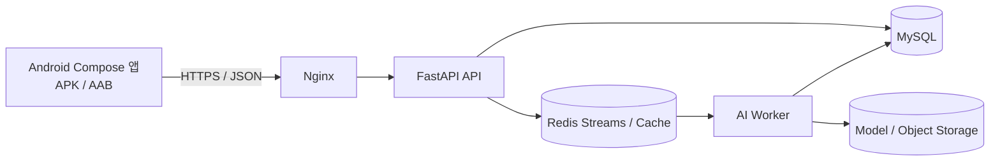

# 틈튼(TMTN)

> 틈틈이 탄탄해지는 오늘의 리듬 — 하루 한 장의 카드로 작은 행동 하나를 고르고 완료하는 Android 앱.

틈튼은 만성질환 예방과 생활습관 개선에 관심 있는 국내 성인을 위한 팀 프로젝트입니다. 사용자가 부담 없는 행동을 선택·실행하고, 활동 기록과 국내 조사 기반 건강 참고 정보를 확인할 수 있도록 돕습니다.

## 현재 상태

이 저장소는 아직 완성된 TMTN 앱이 아닙니다.

- **있는 것:** FastAPI 백엔드 기초, 인증·사용자 API, MySQL·Redis·Nginx Docker 구성, 테스트·CI 초안
- **없는 것:** Android Compose 프로젝트와 APK/AAB 빌드, TMTN 카드·챌린지·기록·알림 등 대부분의 도메인, 실제 AI Worker
- **API 구현량:** 계획 64개 작업 중 현재 5개 라우터 작업

Python FastAPI 코드는 APK 안에 넣는 코드가 아니라 **Android 앱이 호출할 Web API 서버**입니다. 설치 가능한 앱을 만들려면 Android 클라이언트를 별도로 추가해야 합니다. 전체 차이와 우선순위는 [저장소 준비도 점검](docs/TMTN_READINESS_AUDIT.md)을 먼저 확인하세요.

## 제품 원칙

- 비진단·비예측: 건강 결과를 진단·예측하거나 치료를 권고하지 않습니다.
- 세 체계를 분리합니다: 활동 지침 진행도, 오행 기운, KNHANES 건강 참고값을 합산·환산하지 않습니다.
- 미달성에 벌점·차감·비난 표현을 사용하지 않습니다.
- 카드 선택·시작·완료 상태의 최종 진실은 서버가 관리합니다.
- 실패, 권한 거부, 빈 데이터, 오프라인을 서로 다른 상태로 처리합니다.
- 주민등록번호, 전체 생년월일, 원시 정밀 위치처럼 불필요한 데이터는 수집하지 않습니다.

## 목표 아키텍처



- Android: Compose UI, ViewModel, UseCase, Repository, Room/cache, API client
- FastAPI: 요청 검증, 인증·인가, TMTN 유스케이스, 상태 전이와 API 계약
- MySQL: 사용자·동의·카드 snapshot·챌린지 이벤트·활동·기운 원장
- Redis Streams: 긴 AI 작업의 비동기 큐, consumer group, 재시도·복구
- AI Worker: 카드 생성·건강 참고 계산 등 무거운 작업. API 프로세스와 분리

## 구현 현황

| 영역 | 상태 | 현재 범위 |
|---|---|---|
| 인증 | 일부 구현 | 이메일 회원가입·로그인·access/refresh JWT 기초 |
| 사용자 | 일부 구현 | 내 정보 조회·수정 |
| DB | 초기 | Tortoise ORM, 사용자 모델, 초기 migration |
| 카드·챌린지 | 미구현 | 일일 카드 3장, 선택, 시작·완료·skip, 기운 원장 필요 |
| 기록·리포트 | 미구현 | 활동 기록, 타임라인, 캘린더, 주간 리포트 필요 |
| 알림·Health Connect | 미구현 | FCM, 선택 권한, 수동 기록 폴백 필요 |
| AI Worker | 껍데기 | worker entrypoint와 Redis 소비 로직 없음 |
| Android | 미구현 | Gradle·Manifest·Compose·APK/AAB 전체 필요 |
| 인프라 | 초안 | 로컬/운영 Compose, Nginx, 배포 스크립트 |
| 품질 | 초안 | Ruff·Mypy·Pytest·GitHub Actions 보강 필요 |

## 저장소 구조

```text
.
├── .github/
│   ├── workflows/checks.yml          # 현재 Python CI
│   └── PULL_REQUEST_TEMPLATE.md       # TMTN PR 템플릿
├── ai_worker/                         # AI 작업 프로세스 초안
├── app/
│   ├── apis/v1/                       # FastAPI v1 라우터
│   ├── core/                          # 설정, DB, JWT, validator
│   ├── dependencies/                  # 인증 의존성
│   ├── dtos/                          # Pydantic 요청·응답 모델
│   ├── models/                        # Tortoise DB 모델
│   ├── repositories/                  # 데이터 접근
│   ├── services/                      # 비즈니스 로직
│   ├── tests/                         # API 테스트
│   └── main.py                        # FastAPI entrypoint
├── docs/
│   ├── DEVELOPMENT_ENVIRONMENT.md
│   ├── TMTN_READINESS_AUDIT.md
│   ├── GIT_BRANCH_STRATEGY.md
│   └── PR_AND_CODE_REVIEW_GUIDE.md
├── envs/                              # 값이 예시인 환경 변수 템플릿
├── infra/                             # 운영 Compose와 Nginx 설정
├── scripts/                           # CI·배포 스크립트
├── docker-compose.yml                 # 로컬 서비스 구성
├── pyproject.toml                     # Python 의존성과 품질 설정
└── uv.lock                            # 잠금 파일
```

한 저장소에 Android를 추가할 경우 Python의 `app/`과 Android 기본 `app` 모듈 이름이 충돌합니다. 기능 개발 전에 `backend/`, `android/`, `contracts/`, `docs/` 형태의 모노레포 구조를 ADR로 확정하는 것을 권장합니다.

## 사전 준비

- Python `3.13.15` — `.python-version`으로 고정
- [uv](https://docs.astral.sh/uv/) `0.12.5` — `pyproject.toml`에서 강제
- Git `2.45+`
- Docker Engine `29.6+`와 `docker compose` plugin v2+
- Android 개발 시 Android Studio `Quail 2 | 2026.1.2`, JDK 17

Python 3.14는 `asyncmy` 호환 문제로 지원하지 않습니다. 전체 백엔드·Docker·Android 버전과 설치 확인 명령은 [공동 개발 환경·버전 기준](docs/DEVELOPMENT_ENVIRONMENT.md)을 따릅니다.

## 로컬 실행

### 1. 저장소 받기

```bash
git clone https://github.com/AI-HealthCare-05/AH_05_01.git
cd AH_05_01
```

### 2. 공통 Python 설치

```bash
uv python install 3.13.15
uv run python --version
```

예상 출력은 `Python 3.13.15`입니다.

### 3. 환경 변수 만들기

PowerShell:

```powershell
Copy-Item envs/example.local.env .env
```

macOS/Linux:

```bash
cp envs/example.local.env .env
```

`.env`의 모든 예시 비밀번호와 secret을 로컬 값으로 바꿉니다. 실제 `.env`는 commit하지 않습니다.

### 4. Docker Compose 실행

```bash
docker compose up -d --build
docker compose ps
```

새 MySQL 볼륨을 처음 만들 때 `infra/mysql/init/01-grant-test-database.sh`가 실행되어 `.env`의 `DB_USER`에 `test` 데이터베이스 전용 권한을 부여합니다. 테스트는 이 격리 DB를 세션마다 생성하고 종료 시 삭제합니다.

초기화 스크립트를 추가하기 전에 이미 MySQL 볼륨을 만든 환경에서는 다음 명령을 한 번 실행합니다. 이 명령은 반복 실행해도 안전합니다.

```bash
docker compose exec mysql bash /docker-entrypoint-initdb.d/01-grant-test-database.sh
```

- Swagger UI: `http://localhost/api/docs`
- ReDoc: `http://localhost/api/redoc`
- OpenAPI JSON: `http://localhost/api/openapi.json`

종료:

```bash
docker compose down
```

DB 데이터를 포함해 제거하는 `docker compose down -v`는 저장 데이터가 삭제되므로 의도를 확인한 경우에만 사용합니다.

### 5. 백엔드만 실행

MySQL과 Redis가 먼저 실행 중이어야 합니다.

```bash
uv sync --frozen --group app
uv run uvicorn app.main:app --reload
```

### 6. AI Worker

```bash
uv sync --frozen --group ai
uv run python -m ai_worker.main
```

현재 `ai_worker/main.py`는 비어 있어 실제 작업을 처리하지 않습니다.

## 현재 API

Base path는 현재 `/api/v1`입니다.

| Method | Path | 설명 |
|---|---|---|
| `POST` | `/api/v1/auth/signup` | 이메일 회원가입 |
| `POST` | `/api/v1/auth/login` | 로그인 |
| `GET` | `/api/v1/auth/token/refresh` | access token 갱신 |
| `GET` | `/api/v1/users/me` | 내 정보 조회 |
| `PATCH` | `/api/v1/users/me` | 내 정보 수정 |

최신 TMTN 계약은 `/v1/*`와 다른 인증 경로·토큰 흐름을 정의하므로 Android 구현 전에 OpenAPI를 기준으로 통일해야 합니다. 현재 endpoint를 앱의 확정 계약으로 사용하지 마세요.

## 품질 검사

MySQL을 먼저 실행하고 `healthy` 상태인지 확인합니다.

```bash
docker compose up -d mysql
docker compose ps mysql
```

그다음 전체 검사를 실행합니다.

```bash
uv run ruff check .
uv run ruff format . --check
uv run mypy app ai_worker
uv run coverage run -m pytest app
uv run coverage report -m
```

고정된 Python 3.13.15와 MySQL 8.0.46 환경에서 Ruff, 포맷 검사, Mypy 52개 파일, Pytest 9개 전체 테스트가 통과했습니다. 현재 테스트 커버리지는 91%입니다. 새 기능 PR은 이 기준선을 낮추지 않아야 합니다.

## Android·APK 계획

APK는 FastAPI를 패키징해서 만드는 것이 아닙니다. Android Studio에서 Kotlin·Compose 앱을 만들고 HTTPS API를 호출합니다.

권장 Android 계층:

```text
android/
├── app/                 # Application, DI, navigation, build variants
├── core/                # 공통 오류·네트워크·저장소
├── domain/              # 순수 Kotlin 모델·UseCase·Repository interface
├── data/                # API/Room 구현과 DTO mapper
├── presentation/        # Compose 화면·ViewModel
├── design-system/       # TMTN theme·component·접근성
└── feature/             # auth, onboarding, card, challenge, record, settings
```

주요 규칙:

- domain은 Android framework, data, presentation에 의존하지 않습니다.
- refresh token은 Android Keystore 기반 저장소에 보관합니다.
- FCM, Health Connect, 위치는 사용자 행동 뒤 최소 권한으로 요청합니다.
- 오프라인에서 조회 캐시는 허용하되 카드 선택·완료를 로컬에서 확정하지 않습니다.
- QA 공유는 debug/staging APK, 스토어 배포는 서명된 AAB를 기본으로 합니다.
- APK/AAB와 keystore는 Git에 commit하지 않습니다.

Android 최초 기준은 `compileSdk=36`, `targetSdk=36`, `minSdk=28`, AGP `9.1.1`, Gradle `9.3.1`, Kotlin `2.4.10`, Compose BOM `2026.08.00`입니다. 세부 라이브러리 버전은 [공동 개발 환경·버전 기준](docs/DEVELOPMENT_ENVIRONMENT.md)에 고정했습니다.

## API 버전 정책

- 기존 v1 앱이 쓰는 필드와 의미를 삭제·변경하지 않습니다.
- 호환되지 않는 변경은 `/v2`로 만들고 v1 종료 일정과 migration guide를 제공합니다.
- 서버는 최소 한 릴리스 동안 구버전 앱과 신버전 앱이 함께 동작하도록 합니다.
- OpenAPI 계약을 먼저 변경하고 서버·Android 생성 코드와 계약 테스트를 갱신합니다.
- 쓰기 요청의 재시도 안전성을 위해 idempotency key를 사용합니다.

## 보안 주의

다음 파일과 값은 GitHub에 올리지 않습니다.

- `.env`, 실제 JWT·DB·Redis·OAuth·FCM secret
- Android `.jks`, `.keystore`, signing password
- 인증서, 운영 로그, DB dump, 실사용자·원본 건강 데이터
- `.venv`, cache, build, APK, AAB, 모델과 대용량 데이터

강의·외부 템플릿 코드는 재배포 가능한 라이선스인지 확인하고 필요한 출처를 `LICENSE`·`NOTICE`에 기록합니다.

## 협업 문서

- [공동 개발 환경·버전 기준](docs/DEVELOPMENT_ENVIRONMENT.md)
- [저장소 준비도·누락 항목](docs/TMTN_READINESS_AUDIT.md)
- [Git 브랜치 전략](docs/GIT_BRANCH_STRATEGY.md)
- [PR·코드 리뷰 가이드](docs/PR_AND_CODE_REVIEW_GUIDE.md)
- [실제 PR 템플릿](.github/PULL_REQUEST_TEMPLATE.md)

브랜치 전략은 `main`·`develop` 기반 경량 GitFlow, 작업 PR은 squash merge를 기본으로 합니다. 인증·개인정보·건강 데이터·DB migration·인프라 변경은 2명 승인이 필요합니다.

커밋 템플릿을 사용하려면 저장소에서 한 번 설정합니다.

```bash
git config commit.template .github/commit_template.txt
```

## 기여 시작

1. 준비도 점검의 P0 이슈를 GitHub Issue로 등록합니다.
2. `develop` 브랜치와 보호 ruleset을 설정합니다.
3. 이슈에서 `feature/<issue>-<slug>` 브랜치를 만듭니다.
4. 작은 PR로 OpenAPI·DB·백엔드·Android를 수직 슬라이스 단위로 구현합니다.
5. 리뷰와 필수 CI를 통과한 뒤 merge합니다.

자세한 규칙은 협업 문서가 README보다 우선합니다.

## 라이선스

현재 저장소에는 명시적인 라이선스가 없습니다. 공개 저장소로 운영할 경우 팀 소유권과 강의 템플릿의 재배포 조건을 확인한 뒤 `LICENSE`와 필요한 `NOTICE`를 추가하세요. 라이선스가 확정되기 전에는 코드의 외부 재사용 권한을 허용한다고 간주하지 않습니다.
