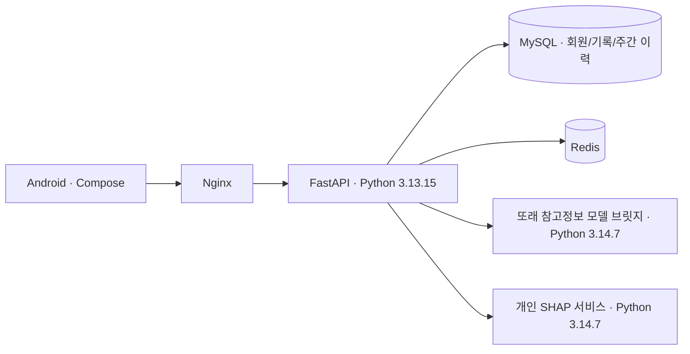

# 틈튼 · TMTN


**하루 한 장의 카드로 작은 실천을 시작하고, 틈튼이와 함께 댐을 채우는 Android 앱입니다.**

오늘 할 수 있는 행동을 고르고, 운동과 생활습관을 기록하고, 틈튼일보에서 한 주를 돌아봅니다. 건강 분석 결과는 비진단용 참고 정보이며 실제 측정값이나 치료 효과를 뜻하지 않습니다.

## 현재 앱

2026-09-21 `main` 기준 Android **1.0.3 / versionCode 4**입니다. Kotlin·Jetpack Compose 앱과 FastAPI 서버가 구현되어 있으며, [PR #21](https://github.com/AI-HealthCare-05/AH_05_01/pull/21)과 [PR #24](https://github.com/AI-HealthCare-05/AH_05_01/pull/24)의 시안 C·개인 XAI 통합본을 포함합니다. Git 병합 상태와 실제 EC2 배포 상태는 별개입니다.

| 화면 | 할 수 있는 일 |
| --- | --- |
| 홈 · 오늘의 카드 | 카드 3장 중 1장을 선택하고 행동을 시작·이어 하기. 완료 후 틈튼이의 응원과 재료 보상 확인 |
| 틈새운동 | 오늘 카드 완료 후 열리는 추가 운동. 하루 최대 5가지 목록을 보여 주고, 보상은 최대 2회 |
| 운동 측정 | 움직임 인식·미인식·일시정지·진행률 표시. 응원·일시정지·달성 정지 이미지와 저장 실패 시 재시도 |
| 기록 | 달력에서 실천·쉼과 날짜별 기록 확인 |
| 틈튼일보 | 월요일~일요일 주간면과 일간면, 지난주 실천 비교, 현재 댐, 저장된 개인 XAI 참고점수 이력 |
| 댐 | 재료를 쌓아 0~5단계 성장, 재료 설명과 완료 카드첩 확인 |
| 내 정보 | 기본·신체·운동 정보, 생활시간·알림, 동의·권한·계정 관리 |

홈에는 **카드 미션·틈새운동·틈튼일보·허리둘레**가 배치됩니다. 카드 완료 후의 응원은 서버에서 저장이 확인된 틈새운동 0·1·2회에 따라 달라집니다. 허리둘레는 입력한 신체 정보에 따른 **추정값**입니다.

## 먼저 읽기

- 앱의 상태와 화면 흐름: [현재 앱 안내](docs/APP_GUIDE.md)
- SDK·Python·의존성 설치: [개발 환경](docs/DEVELOPMENT_ENVIRONMENT.md)
- 서버 담당자: [EC2 배포 및 XAI 연결](docs/DEPLOYMENT.md)
- XAI가 설명하는 값과 표시 조건: [XAI 안내](docs/XAI.md)
- 전체 문서와 검증 근거: [문서 목록](docs/README.md)

## 실행하기

### Android APK

Android Studio에서 저장소 안의 **`android/` 폴더**를 엽니다. JDK 17과 Android SDK 35를 사용합니다.

```bash
cd android
./gradlew assembleDebug
```

Windows PowerShell에서는 `android/`에서 `.\gradlew.bat assembleDebug`를 실행합니다. 출력은 `android/app/build/outputs/apk/debug/app-debug.apk`입니다.

앱은 API 서버에 연결됩니다. 기존 앱을 업데이트하려면 같은 서명키를 사용해야 합니다. Google 로그인 설정, API 주소, 검사용 앱과의 차이는 [Android 안내](android/README.md)를 확인하세요.

### 로컬 API

Python **3.13.15**, uv **0.12.5**, 개발용 MySQL·Redis가 필요합니다. 저장소 루트에서 실행합니다.

```bash
uv sync --frozen --group app --group dev
cp -n envs/example.local.env .env
# .env의 예시 값과 DB 접속 정보를 로컬 환경에 맞게 수정
docker compose up -d mysql redis
# MySQL 준비 후, 새 개발 DB에 적용
uv run aerich upgrade
uv run uvicorn app.main:app --reload --host 127.0.0.1 --port 8000
```

PowerShell에서는 복사 명령을 `if (-not (Test-Path .env)) { Copy-Item envs/example.local.env .env }`로 바꿉니다. 기존 `.env`는 보존합니다. 로컬 호스트의 `DB_HOST`와 컨테이너의 `DB_HOST`는 다릅니다. 자세한 설정·테스트 DB 권한은 [개발 환경](docs/DEVELOPMENT_ENVIRONMENT.md)을 따릅니다.

API 문서는 서버 실행 후 `http://127.0.0.1:8000/api/docs`에서 확인합니다. API를 켜는 것만으로 개인 XAI가 활성화되지는 않습니다. 모델 연결은 [EC2 배포 안내](docs/DEPLOYMENT.md)의 별도 절차입니다.

## 구성



| 경로 | 역할 |
| --- | --- |
| `android/` | 실제 앱, Compose 화면, 센서, Retrofit 통신, UI·단위 검사 |
| `app/` | 인증·카드·미션·기록·댐·일보 API, 모델 연결, DB 마이그레이션 |
| `app/scripts/data/` | 서버 카드 콘텐츠 원본·적재 안내 |
| `app/data/journal/` | 읽을거리·출처·검토 범위별 승인 기록 |
| `model_service/` | 개인 SHAP 서비스와 실제 모델 검증 도구 |
| `model_assets/xai/` | SHA-256으로 확인하는 XAI 배포 원본 |
| `tuntun_peer_bridge/` | 또래 참고정보 모델의 동결 배포 묶음 |
| `ai_worker/` | 별도 Worker 구성. 개인 XAI 실행 경로는 `model_service/` |
| `infra/`, `tools/` | 인프라 설정, 모델 검사·환경 준비·APK 빌드 도구 |
| `tests/`, `tests_model_review/` | 통합 회귀·AI 환경·점수 정책 검사 |
| `docs/` | 현재 앱·개발·배포·XAI·협업·동의 문서와 모델 근거 |

## XAI와 읽을거리

개인 XAI는 실제 모델 계산에서 나온 **입력별 기여도**를 보여 줍니다. 저장된 주간 결과가 있어야 점수 그래프를 그리며, 없는 과거 점수를 만들어 채우지 않습니다. 일반 신문 읽을거리는 출처와 승인을 확인한 목록에서 선택합니다. XAI나 LLM이 모든 기사를 새로 쓰는 구조는 아닙니다.

현재 XAI 설정과 읽을거리 승인은 **팀 내부 검토·시연용**입니다. 공개 운영 승인 게이트와 분석 동의·입력 범위 검사를 유지합니다. 모델 원본의 줄바꿈·내용·해시를 임의로 바꾸지 않습니다.

## 검증과 협업

CI는 Ruff, MySQL API·마이그레이션, 독립 회귀·정책, AI 의존성, Android 빌드·단위 검사·lint를 실행합니다. [통합 검증 기록](docs/INTEGRATION_2026-09-21.md)에 실제 모델·실기기 검사 범위와 남은 제한을 구분했습니다. CI 통과는 EC2 배포나 모든 타입 오류의 해소를 뜻하지 않습니다.

변경은 [Git 브랜치 전략](docs/GIT_BRANCH_STRATEGY.md)과 [PR 리뷰 가이드](docs/PR_AND_CODE_REVIEW_GUIDE.md)에 따라 PR로 반영합니다. `main`의 현재 소스에 과거 ZIP이나 폐기된 시안을 다시 덮어쓰지 않습니다.

## 팀

| 담당 | 영역 |
| --- | --- |
| 문홍주 | 팀장 · Android · UX |
| 장혁수 | 백엔드 · DB · 인프라 |
| 박강호 | 모델 · 데이터 |
| 권병학 | 모델 지원 · 백엔드 지원 · QA |
| 김지현 | 챌린지 콘텐츠 · 프론트 |

저장소 전체의 외부 재사용 라이선스는 별도로 명시되어 있지 않습니다. 포함된 폰트·외부 자산·모델 묶음은 각 원본의 이용 조건을 확인합니다.
