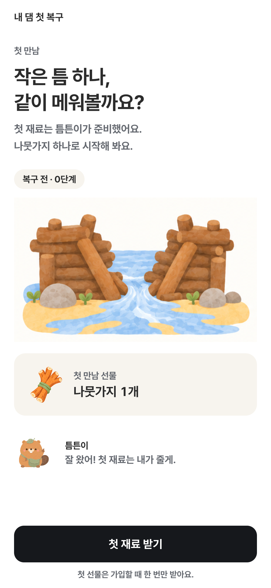
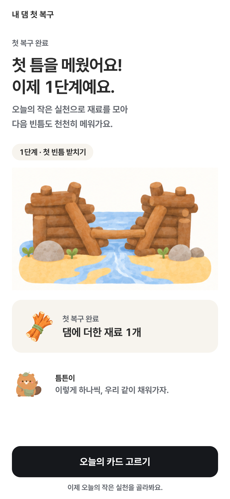

# 최종 UI · 첫 댐 복구 · SHAP/XAI 통합 검토

기준: develop `d2b88b4`. 최종 UI 작업 폴더에 누적된 앱·서버·문서 변경을 함께 검토합니다.

## 주요 변경

- 홈·카드·약관·온보딩·시트 모션과 작은 화면 대응을 정리했습니다.
- 첫 가입 선물 1개를 받아 댐에 놓고, 서버 저장 뒤 1단계를 시작합니다. 재진입·재시도 때 중복 지급하지 않습니다.
- 틈튼일보는 월요일 시작, 완료 미션명·완료일, 일간 읽을거리 1개·주간 다른 주제 2개로 구성합니다.
- 개인 SHAP는 현재 입력·모델·점수와 일치할 때 펼쳐 볼 수 있습니다. 활동 비교와 챌린지 안내는 하루 카드·틈새운동 상태를 따릅니다.
- 새 주간 삽화, 재료명·아이콘 통일, 홈 허리둘레 영역과 오프라인 HTML 검토본을 포함합니다.
- 댐 0~5단계에서 모래로 새는 물길이 줄어드는 새 그림, 단계 미리보기, 캐릭터 색·외형 통일과 재료 도감 삽화를 반영했습니다. [그림 기준·실기기 확인](dam-water-review-2026-09-16/README.md).

## 검증

2026-09-16 PR 제출 전 확인:

| 항목 | 결과 |
|---|---|
| Android `:app:testDebugUnitTest :app:assembleDebug --offline` | 성공, JVM 122개 실패 0 (동일 소스에 대한 Gradle 최신 상태 확인 포함) |
| Python `pytest tests/first_repair tests/test_journal_xai_integration.py -q` | 격리된 테스트 21개 통과 |
| Ruff check / format check | 저장소 Python 코드 통과. 로컬 설치 도구 폴더만 제외, 기존 모델 브릿지 해시 고정 제외 유지 |
| mypy | 변경된 DTO·서비스·첫 복구 Router/Repository 8개 통과. `--follow-imports=silent`, 타입 없는 함수 본문은 기본 검사 범위 밖 |
| `git diff --check` | 통과 |
| 이전 실기기 QA | UI 62개, 첫 복구 관련 22개 통과. 상세 범위는 아래 문서 참고 |
| 새 댐 그림 적용 후 실기기 QA | 댐 4개·첫 복구 6개·첫 댐 4개, 합계 14개 통과. 320dp·글자 1.8배 포함 |

PC의 uv 0.12.3과 저장소 고정 버전 0.12.5가 달라 `uv run` 명령은 실행 전 차단되었습니다. 고정 버전과 잠금 파일을 바꾸지 않고 기존 Python 3.13 가상환경에서 Ruff·pytest·mypy를 직접 실행했습니다. pre-commit은 이 PC에 설치되어 있지 않습니다. 새 회귀 테스트 21개는 GitHub Actions에서도 실행하도록 추가했습니다.

MySQL 전체 테스트·실제 계정으로 API→모델→앱 전체 실행·운영 마이그레이션은 이 PR 제출 과정에서 실행하지 않았습니다. 이전 실기기 검증은 최종 SHAP 통합 전체의 실계정 검증을 의미하지 않습니다.

## 리뷰할 화면

- [SHAP/XAI·댐 화면 검토 HTML](xai-integration-2026-09-16/index.html): 내려받아 브라우저에서 열면 됩니다. 가상 설문·미션 기록·댐 재료를 사용합니다. 글꼴과 이미지를 내장해 약 33 MB입니다.
- [기존 UI 실기기 검증 범위](ui-review-2026-09-16/DEVICE-QA.md)
- [첫 댐 복구 구현·검증](FIRST_REPAIR_2026-09-16.md)

첫 댐 복구의 실기기 캡처이며, 실제 사용자 계정 데이터는 사용하지 않았습니다.

| 첫 재료 안내 | 복구 완료 |
|---|---|
|  |  |

## 담당자가 적용할 순서

1. 첫 복구 마이그레이션 `19_20260916140753_add_first_repair.py`를 검토하고 서버 배포 환경에서 적용합니다.
2. 첫 복구 API·신규 가입 처리를 포함한 서버를 배포합니다. 기존 계정에는 첫 선물을 소급 지급하지 않습니다.
3. 개인 SHAP 검토 환경에는 기존 해시 고정 모델 배포물·전용 Python 환경을 준비하고 `TUNTUN_XAI_URL`, `TUNTUN_XAI_TOKEN`을 서버 환경에 주입합니다. [실행 안내](xai-integration-2026-09-16/README.md)를 따릅니다.
4. 읽을거리는 `app/data/journal/approvals.json`에 실제 검수를 마친 승인 기록이 있어야 API에 노출됩니다. 현재 승인 목록은 비어 있습니다.
5. Android를 업데이트하고 신규 테스트 계정·기존 계정에서 가입, 미션, 신문과 실패·재시도 상태를 확인합니다.

모델의 기존 운영 공개 제한을 유지합니다. 이 PR 제출은 운영 모델 공개 승인이나 원격 서버 배포를 수행하지 않습니다. 미션 기록으로 시간을 추정하거나 설문 운동량에 더하지 않습니다.

## 롤백·데이터

첫 복구가 완료된 계정의 선물 합산·단계 읽기 처리는 UI를 되돌려도 유지해야 합니다. 지급 행을 삭제하거나 downgrade를 바로 실행하지 마세요. SHAP 작업 서버를 끄면 개인 설명은 사용할 수 없음으로 처리하며 가상 결과로 대체하지 않습니다.

API 키·로컬 환경 설정·서명 키·APK·원본 참여자 자료·신규 학습 모델은 포함하지 않습니다. KNHANES 파일은 나이대·성별 집단 집계치이며, debug/HTML 개인 예시는 가상 설문입니다. 새 데이터 수집은 추가하지 않습니다.
