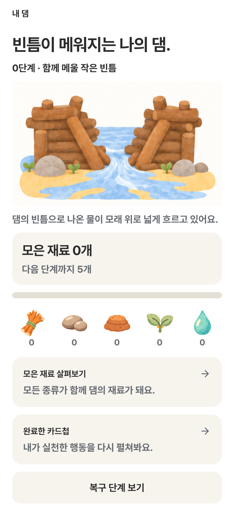
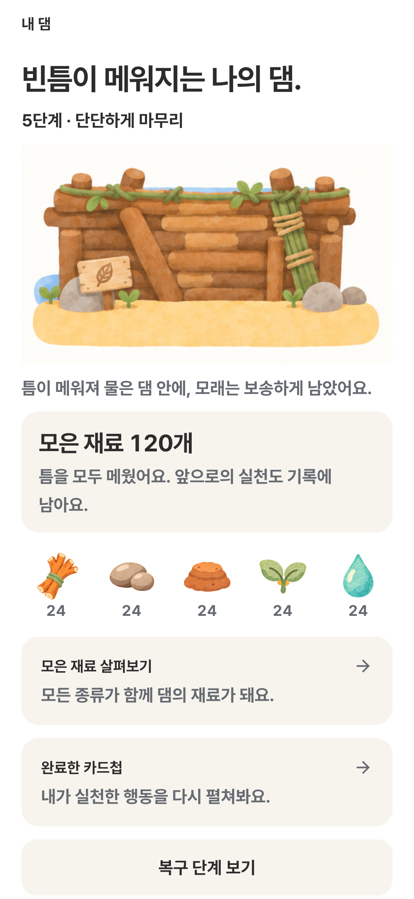
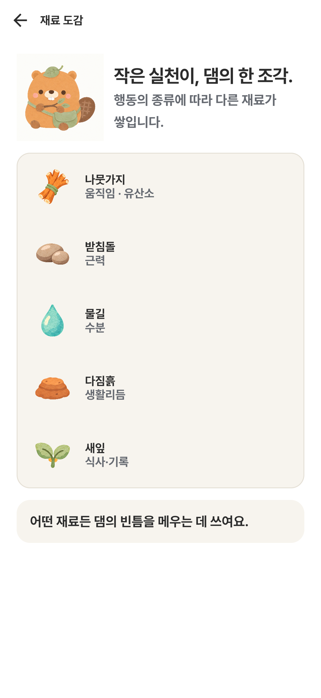

# 댐의 물길과 틈튼이 그림 기준

## 반영한 이야기

미션으로 모은 재료가 빈틈을 메우면서 모래 위로 새던 물이 줄어듭니다. 기존 수채화 톤과 댐 구도를 유지했습니다.

| 단계 | 그림에서 달라지는 것 |
| --- | --- |
| 0 | 중앙 빈틈으로 나온 넓은 물줄기가 모래 위로 퍼짐 |
| 1 | 첫 나무를 받쳐 물줄기가 조금 줄어듦 |
| 2 | 기둥 사이가 연결되며 모래 위 물길이 좁아짐 |
| 3 | 작은 틈으로만 물이 흐름 |
| 4 | 마지막 틈에 물방울만 남음 |
| 5 | 빈틈이 닫히고 앞쪽 모래가 마름. 물은 댐 뒤에 남음 |

단계는 서버가 내려주는 실천 재료의 기록입니다. 질환 참고점수나 실제 건강 변화와 연결하지 않습니다. 쉬는 날에 댐을 무너뜨리거나 단계를 되돌리는 처리를 추가하지 않았습니다.

## 앱에서 보는 위치

- **댐 탭 → 내 댐:** 실제 진행 단계의 그림과 물길 문장.
- **댐 탭 → 복구 단계 보기:** 0~5단계 모습을 직접 눌러 비교. 선택은 미리보기 상태만 바꾸며 실제 재료·단계를 수정하지 않습니다.
- **첫 복구·첫 댐 안내:** 같은 장면 파일을 사용. 첫 재료 이동 위치도 새 그림 비율에 맞췄습니다.
- **댐 탭 → 모은 재료 살펴보기:** 나뭇가지를 든 틈튼이 삽화 추가.
- **홈·일보·기존 저녁 신문:** 신문을 든 틈튼이와 저녁 삽화의 색·얼굴·몸 비율 통일.
- **HTML 홈 허리둘레 예시:** 줄자를 든 그림도 같은 기준으로 정리. 이 에셋은 현재 Android 메인 코드에서 직접 사용하지 않습니다.

서버의 기존 단계 기준은 유지합니다. 첫 복구 선물을 받은 계정은 재료 1개로 1단계, 기존 계정은 5개로 1단계이며, 2~5단계는 각각 15·35·70·120개입니다. HTML 댐 예시는 기존 계정 기준의 가상 재료 수를 사용합니다.

## 캐릭터를 계속 맞추는 기준

기준 원본은 `beaver_card.png`, `beaver_standing.png`입니다.

- 낮은 채도의 살구색 몸, 짧고 둥근 몸통, 작은 둥근 귀.
- 짙은 갈색 눈과 코, 크림색 주둥이, 앞니 두 개, 은은한 분홍 볼.
- 세이지색 잎 모자와 같은 계열의 사선 가방.
- 갈색 타원 꼬리와 옅은 격자무늬.
- 부드러운 수채화 질감. 두꺼운 검은 외곽선·입체 광택·짙은 주황·길쭉한 몸통을 추가하지 않음.
- 새 그림은 위 원본을 이미지 참조로 전달하고 소품·자세만 바꿈.

`beaver_building_dam.png`, `dam_stage_*_v2.png` 등 과거 파일은 현재 메인 코드에서 참조하지 않습니다. 새 화면에 연결하지 마세요. 댐 단계 그림은 `DamArtwork`와 `dam_water_repair_sheet.png`를 사용합니다. 기존 `figma_dam_repair_sheet.png`는 원본 보존용입니다.

## 표시와 움직임

- 1536×1024 원본에서 각 단계의 512×304 영역을 원래 비율로 표시합니다. 위쪽 행 y=158, 아래쪽 행 y=560입니다.
- 새 단계는 기존 모션 토큰의 240ms 페이드로 전환합니다. 움직임 줄이기는 160ms 페이드, 키보드 입력은 즉시 전환합니다.
- 반복해서 흔들리는 물 애니메이션은 사용하지 않습니다. 장면의 물길과 단계 전환으로 변화를 보여줍니다.
- 화면 읽기 도구에 현재 단계·물길 상태를 전달하고 단계 선택에 라디오 버튼 의미를 제공합니다.
- 이미지는 따뜻한 흰 종이 배경을 포함합니다. 투명 이미지로 취급하지 않습니다.

## 검증

- Android `:app:testDebugUnitTest :app:assembleDebug --offline` 성공. JVM 결과는 122개, 실패 0개.
- 별도 검증 패키지에서 `DamWaterStoryUiTest`, `FirstRepairUiTest`, `FirstDamUiTest` **14개 통과**. 처음에는 기기가 절전 상태여서 화면이 열리지 않았고, 절전 해제 후 같은 테스트를 다시 실행했습니다.
- 새 테스트 4개: 0~5단계 그림·설명, 단계 미리보기의 실제 기록 보존, 320dp·글자 1.8배 접근, 재료 도감의 기존 버튼 연결.
- 실기기 캡처로 모래 물길·댐 상단·큰 글자·첫 복구 완료 배치를 확인했습니다. 캡처는 가상 데이터이며 하단 탭 밖의 개별 화면 테스트입니다.
- HTML에서도 댐 탭 → 단계 보기 → 5단계 → 키보드 Home으로 0단계 복귀를 확인했습니다.

| 0단계 | 5단계 |
| --- | --- |
|  |  |

## 산출물

- [앱 HTML 미리보기](../xai-integration-2026-09-16/index.html?view=dam)
- [이미지 제작 도구·프롬프트 요약](PROMPTS.md)
- [참조 원본 및 결과 파일 해시](assets.json)

이번 변경에 서버 API·DB·모델·SHAP 계산식 변경은 없습니다. 앱 업데이트에 포함되는 화면·그림 변경이며 EC2 재학습이나 추가 API 키가 필요하지 않습니다.
