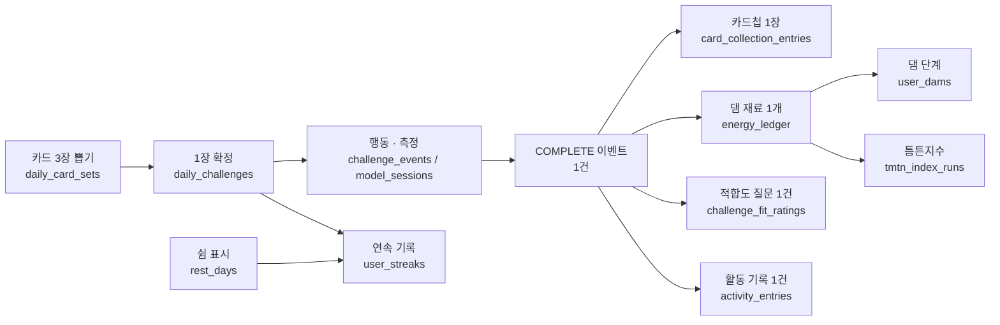
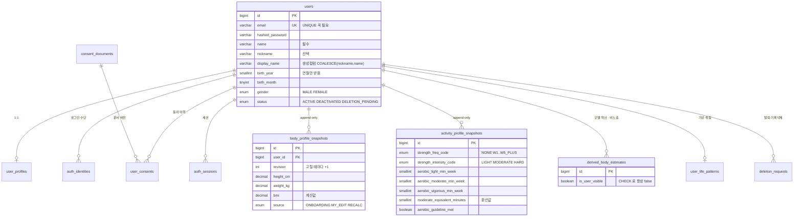
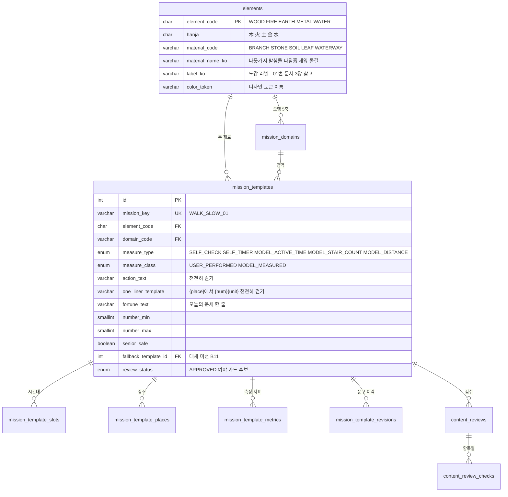
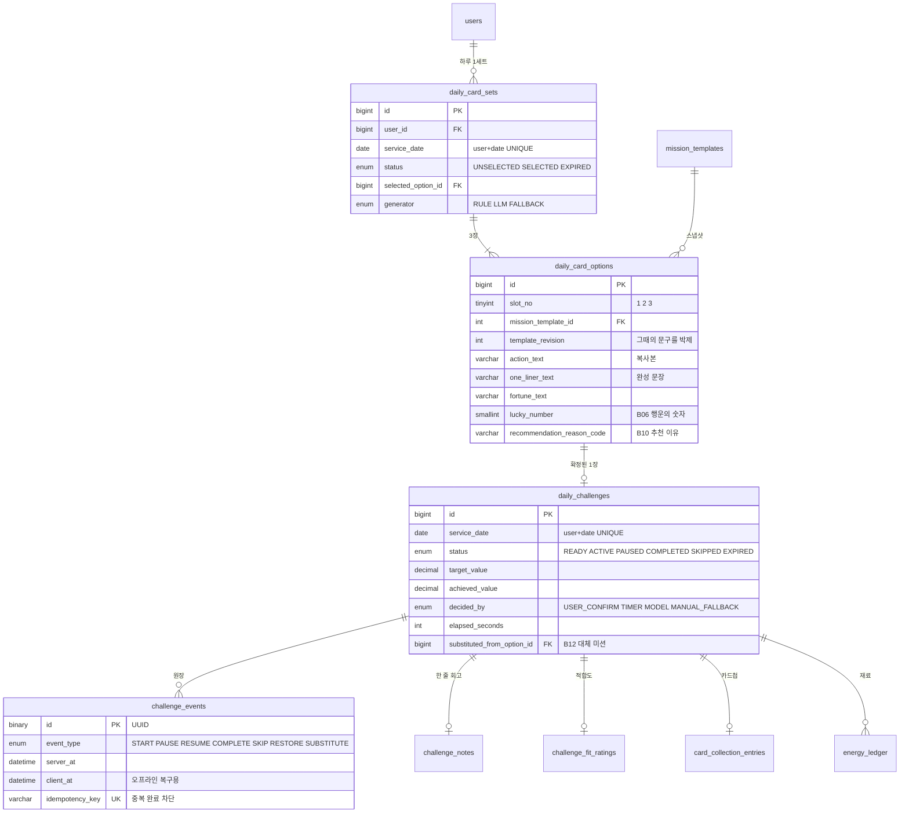
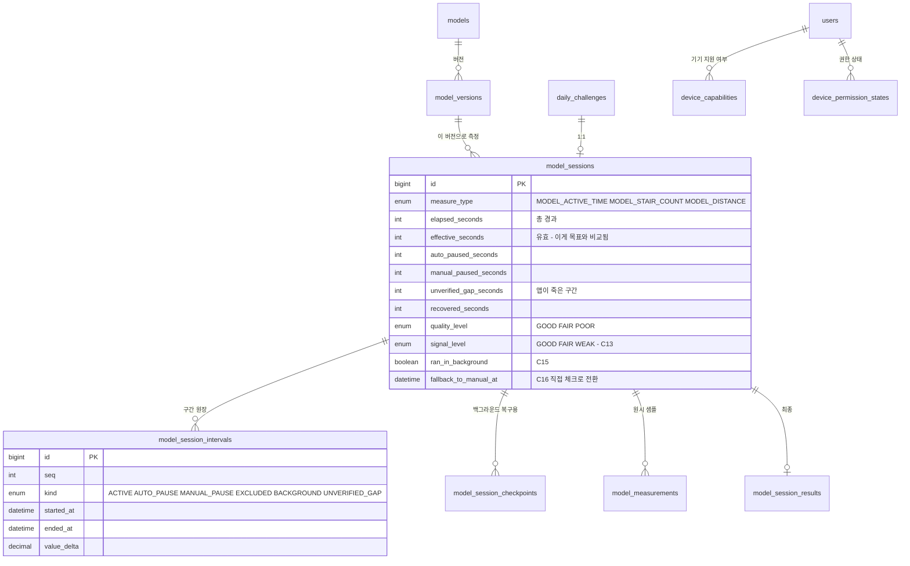
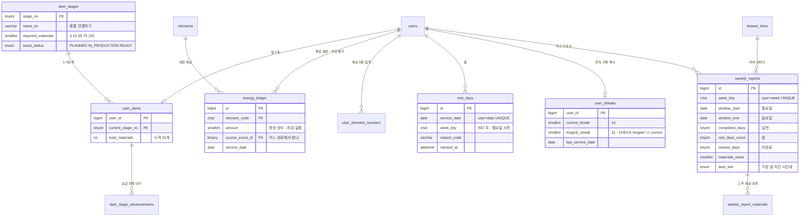
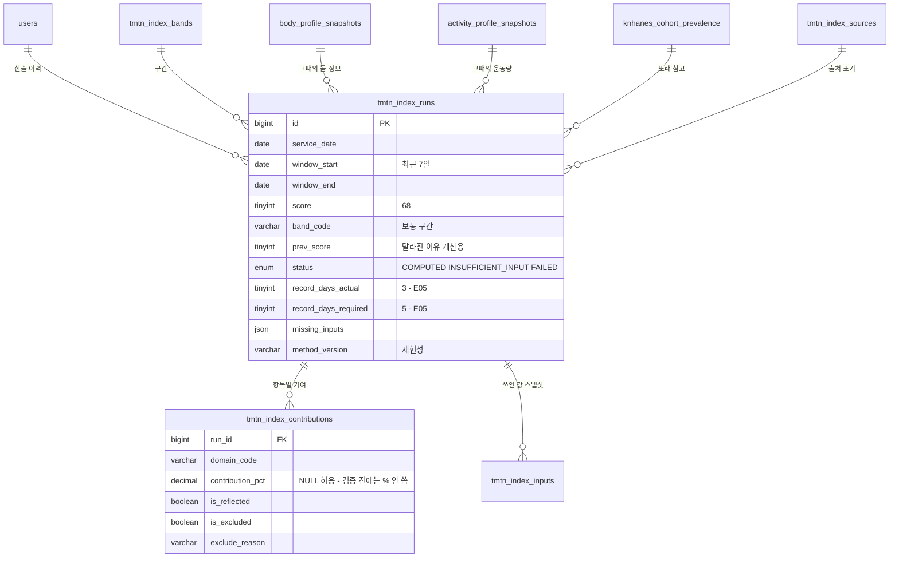
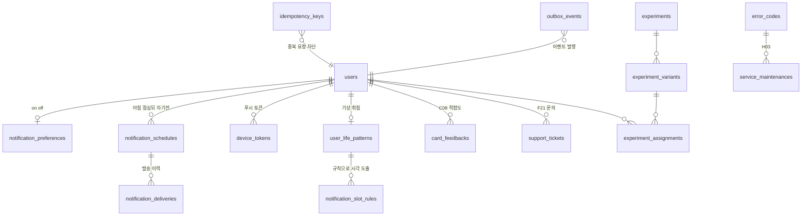

# 02 · 도메인별 ERD

114개를 한 장에 그리면 아무도 못 읽습니다. **도메인 7개로 나눠 그렸습니다.**
각 도메인의 중심 테이블과 그 관계만 담았고, 코드 마스터 테이블은 생략했습니다.

> GitHub · VS Code · Obsidian 에서 그대로 렌더링됩니다.

---

## 0. 전체 흐름 — 완료 1건이 만드는 것

> **넷은 같은 이벤트 ID를 근거로 삼되 서로 합산하지 않습니다.**
> 카드첩 18장 · 재료 41개 · 완료 20일이 서로 다른 숫자인 게 정상입니다.

---

## 1. 사용자 · 인증 · 동의 · 온보딩 (24 테이블)

**설계 의도 두 가지**

- **몸 정보·운동 정보는 덮어쓰지 않고 쌓습니다** (`revision` 증가). 틈튼지수를 다시 계산할 때
  "그때 어떤 값으로 냈는지"를 재현할 수 있어야 하기 때문입니다.
- **허리둘레는 모델이 역산하고 사용자에게 보여주지 않습니다.** `is_user_visible` 에 CHECK 제약을 걸어
  실수로라도 화면에 나가지 않게 막아 두었습니다.

---

## 2. 미션 원장 — CSV 200장 (16 테이블)

**중요** — `review_status = APPROVED` 인 것만 카드 후보가 됩니다.
검수 안 끝난 문구가 사용자에게 나가지 않게 하는 장치입니다.

---

## 3. 카드 · 챌린지 · 카드첩 (12 테이블)

**설계 의도**

- `daily_card_options` 는 미션 마스터를 **복사해서 박제**합니다.
  나중에 마스터 문구를 고쳐도 **이미 뽑은 카드는 안 바뀝니다.**
- 완료는 `challenge_events` 에 **이벤트로** 남고, `daily_challenges.status` 는 그 결과를 요약한 것입니다.
  진실은 언제나 이벤트 쪽입니다.
- `idempotency_key` — 네트워크가 끊겨 앱이 완료를 두 번 보내도 재료는 한 번만 쌓입니다.

---

## 4. 모델 · 자동 측정 (11 테이블)

**왜 구간 원장을 따로 두나**

"8분 중 5분 4초"를 화면에 정직하게 보여주려면 **어느 구간이 왜 빠졌는지**를 남겨야 합니다.
`UNVERIFIED_GAP` 은 앱이 강제 종료된 구간입니다 — 이 시간은 **유효 시간에 넣지 않습니다.**
C17 앱 복구 화면이 바로 이 구간을 사용자에게 알려 주는 화면입니다.

---

## 5. 비버 · 댐 · 연속 기록 (13 테이블) ★ v5에서 제일 중요

**v5 쉼 규칙이 이 세 테이블로 그대로 표현됩니다**

| 화면이 말하는 것 | 어디서 나오나 |
|---|---|
| 달력의 **실천** | `daily_challenges.status = COMPLETED` |
| 달력의 **쉼** | `rest_days` 에 그 날짜가 있음 |
| 달력의 **미완료** | 지난 날짜인데 위 둘 다 없음 (파생 — 저장하지 않음) |
| "이번 주 남은 쉼 1회 / 2회" | `COUNT(rest_days WHERE week_key = 이번주)` 를 2에서 뺌 |
| "연속 기록 14일째" | `user_streaks.current_streak` |
| "가장 오래 이어간 기록 21일" | `user_streaks.longest_streak` |
| "쉼은 기록을 끊지 않아요" | 연속 계산에서 `rest_days` 날짜를 **건너뜀** |

> **주 2회 상한은 반드시 서버가 셉니다.** 앱에서 세면 기기를 바꾸거나 앱을 지웠다 깔면 숫자가 틀어집니다.
> `ix_rd_week (user_id, week_key)` 인덱스가 그 계산을 위해 있습니다.

> `user_streaks` 는 **캐시**입니다. 진실은 `daily_challenges` + `rest_days` 이고,
> 숫자가 의심스러우면 언제든 다시 계산할 수 있어야 합니다.

---

## 6. 틈튼지수 · 건강 참고 (12 테이블)

**설계 의도**

- **"산출 불가"도 정상 상태입니다.** `status = INSUFFICIENT_INPUT` + `record_days_actual/required` 로
  E05 화면의 "3일 / 7일 · 필요한 기록 5일"이 그대로 나옵니다. 오류가 아닙니다.
- `contribution_pct` 는 **NULL 허용**입니다. 모델 검증이 끝나기 전에는 화면에 %를 쓰지 않습니다.
- `method_version` · `calibration_version` — 나중에 "이 68점은 어떻게 나온 건가"를 재현하기 위한 것입니다.
  **비진단용 참고 정보**라고 화면에 쓰는 이상, 근거를 남길 수 있어야 합니다.

---

## 7. 알림 · 피드백 · 실험 · 운영 (26 테이블)

**알림 시각은 저장하지 않고 규칙으로 계산합니다**

A10에서 받은 기상 7:00 · 취침 23:30 에서 `notification_slot_rules` 를 거쳐
아침 7:00 · 점심뒤 13:00 · 자기전 22:30 이 나옵니다.
사용자가 기상 시각을 바꾸면 **세 알림이 자동으로 따라옵니다.** 뷰 `v_derived_notification_times` 가 그 계산입니다.
