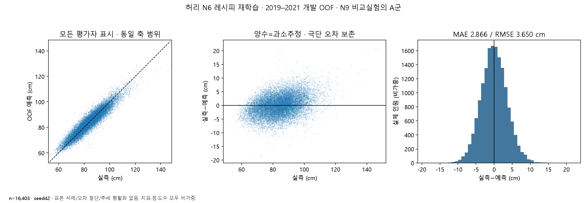
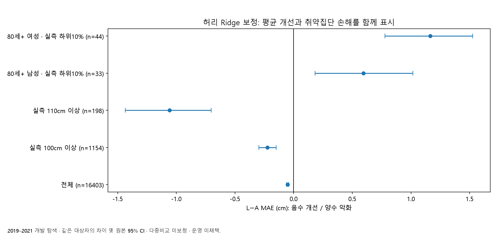
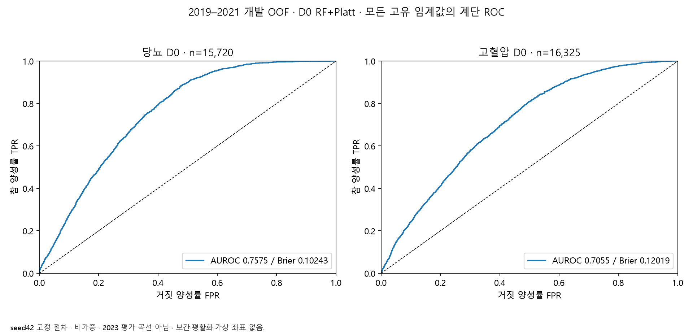
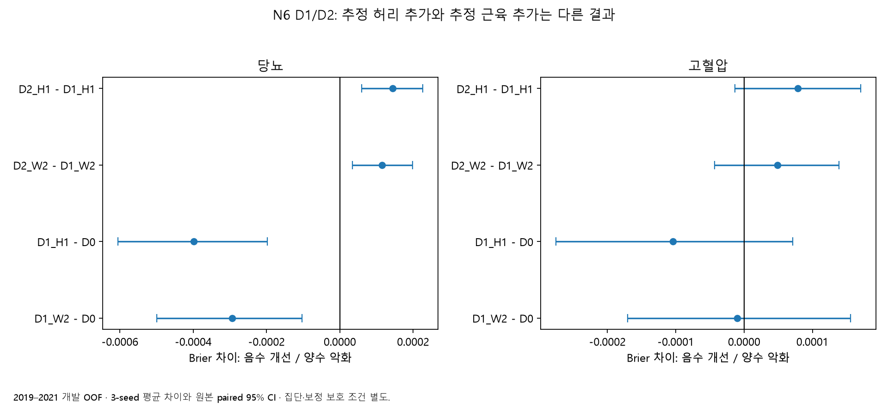
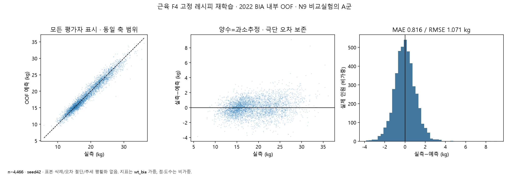
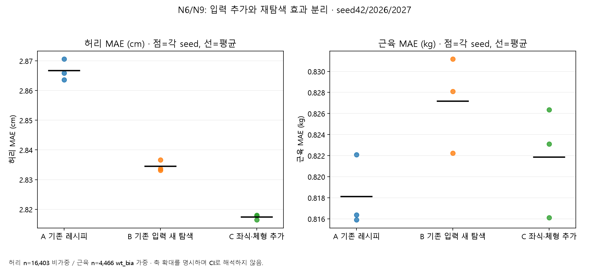
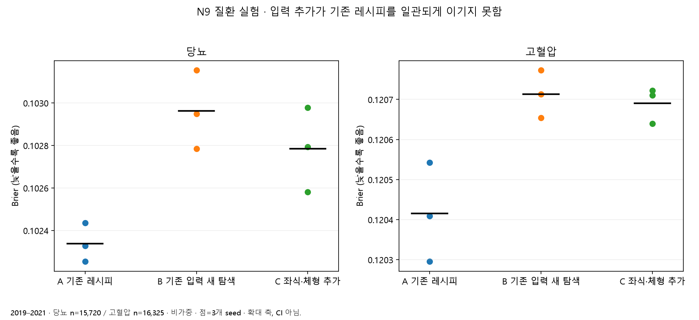

# 적은 입력으로 건강 참고정보를 만들기까지

> 2026-09-17 연구·발표 근거를 보존한 문서입니다. 아래 수치와 그림은 당시 실험 기록이며 공개 운영 승인이나 현재 배포 완료를 뜻하지 않습니다. 현재 앱의 모델 표시 조건은 [XAI 안내](../XAI.md), 연결 검사는 [통합 기록](../INTEGRATION_2026-09-21.md)을 확인합니다.

## KNHANES 기반 허리둘레·당뇨·고혈압·근육량 모델과 틈튼지수 개발 최종 보고

작성 기준: 2026-09-17. 목적: 발표를 위한 개발 의사결정과 실패·보류 실험의 근거 정리. 모델 재학습 없이 기존 보고서·계약·실행 결과와 최신 저장소를 대조하고, 저장된 실제 OOF 예측과 평가 집계로 그림을 재생성했다.

## 1. 발표에서 전달할 핵심

이 프로젝트는 ‘질문을 적게 받아도 건강을 정확하게 진단할 수 있다’는 결론을 얻은 작업이 아니다. 사용자가 제공할 수 있는 정보로 어느 수준까지 신체·검사 관련 참고정보를 추정할 수 있는지 검토하고, 그 한계를 확인하면서 생활습관 실천 서비스에 연결한 과정이다.

초기에는 나이·성별·키·체중에 운동을 더하면 더 정확한 모델을 만들 수 있을 것으로 기대했다. 이후에는 체격 파생변수, 큰 오차를 줄이는 보정, 목둘레 보조모델, 근육량 추정, 추가 설문, 모델 재탐색까지 확장했다. 일부 평균 지표는 개선됐지만 소집단 악화, 추가 입력 부담, 측정 기준 차이, 검증 부족을 함께 고려해 모든 후보를 제품에 넣지는 않았다.

최종 제품 결정은 N6 허리 W2, 당뇨 D0, 고혈압 D0 유지다. 근육량은 연구 성과를 보존하되 서비스와 종합지수에 사용하지 않는다. 틈튼지수는 이 세 예측 모델과 참고 분포, 가입 습관, 실천 기록을 조합하는 제품 계산 체계다. ‘건강 종합 정답’을 학습한 별도의 네 번째 예측 모델은 아니다. [S01–S06, S12]

| 구분 | 채택한 것 | 연구로 남긴 것 |
|---|---|---|
| 허리 | N6 W2 Random Forest | H1 HGB, tail·gate·목둘레, N9, 최신 Ridge 보정 |
| 당뇨 | N6 D0 RF+Platt | D1/D2, 라벨 민감도, 추가 설문, derived6 |
| 고혈압 | N6 D0 RF+Platt | D1/D2, 혈압 성분·회귀, 추가 설문, derived6 |
| 근육 | 현재 제품 적용 없음 | BIA·DXA, F4/F5/F6, 손실·tail·표시·N9 실험 |
| 틈튼지수 | 건강 성분 10:20:20 + 생활습관50, 생활습관 내부 초기20:실천80 | 임상 효과 검증, 센서 실측시간 기반 추가 가산은 미완료 |

## 2. 원자료와 피처: 무엇을 실제 사용했는가

주된 자료는 국민건강영양조사(KNHANES)다. 주 모델의 개발은 2019–2021 자료로 수행했다. 초기 원자료 합계는 22,559명이고 성인·비임신 적격 조건 후 17,852명이다. 모델마다 정답·입력의 관측 조건이 달라 허리 16,403명, 당뇨 15,720명, 고혈압 16,325명으로 나뉜다. 서로 다른 표본의 지표를 같은 사람의 개선처럼 비교하지 않는다. [S01–S04, S07]

### 최종 N6의 원 변수와 변환

| 모델 입력 | KNHANES 원 변수 | 전처리·단위 |
|---|---|---|
| 나이 | `age` | 만 나이, 성인19세 이상; 자료의 80은 80세 이상 top-code |
| 성별 | `sex` | 1=남성, 2=여성. 다른 값을 임의 추정하지 않음 |
| 키 | `HE_ht` | cm |
| 몸무게 | `HE_wt` | kg |
| 여가 유산소량 | 고강도 `BE3_75..78`, 중강도 `BE3_85..88` | 각 강도 참여 여부·일수·시간·분으로 주간 분 계산 후 M+2V |
| 근력 일수 | `BE5_1` | 원 코드1~6을 0~5로 변환; 5는 주5일 이상 |

‘6입력’은 모델이 받는 기본 여섯 값이며 앱 화면의 세부 입력칸 수와 동일하지 않다. 임신 여부 `HE_prg`는 대상 적격성을 위한 메타데이터이며 예측 피처가 아니다. `wt_itvex`, `kstrata`, `psu`는 조사 가중·층·조사구로 평가와 분할에 사용하며 모델 입력으로 넣지 않는다. 개인·가구 식별자는 결합·중복·누수 검사에만 사용한다. [S07–S09]

원 설문의 운동은 평소 주간 여가 활동이며 중고강도에는 10분 이상 지속 문항 조건이 있다. 직업·이동까지 포함한 공식 이진값 `pa_aerobic`을 여가 운동 시간으로 역산하지 않았다. 공식 운동 지표 재현은 품질 감사용 비교이고 서비스 입력은 별도 여가 연속량이다. 초기 문서의 ‘대표 강도 하나×횟수’ 앱 가정은 이후 각 강도별 주간 합계로 정정됐다. 현재 앱의 근력 ‘회’는 사용자 확인에 따라 ‘일’ 의미로 사용한다. [S08, S12]

### 정답과 추가 연구 변수

| 목적 | 변수·정의 | 주의할 의미 |
|---|---|---|
| 허리 회귀 | `HE_wc`, cm | 실측 허리의 단면 추정, 미래 감량 아님 |
| 당뇨 D0 | `HE_fst`≥8시간, `HE_glu`≥126 또는 원 `HE_HbA1c`≥6.5 | 두 검사 모두 관측한 사람의 당시 측정 기준 라벨 |
| 고혈압 D0 | 원 `HE_sbp`≥140 또는 `HE_dbp`≥90 | 원자료의 2·3차 혈압 평균, 당시 측정 기준 라벨 |
| BIA 근육 연구 | `BIA_LRA+ BIA_LLA+ BIA_LRL+ BIA_LLL` | 사지 lean mass 합 kg. 전신 골격근량과 같은 정답 아님 |
| 좌식 추가 | `BE8_1`, `BE8_2` | 시간+분/60. 주중/주말 쌍이 아님; N9에서는 4/6/8/12시간 경계 범주화 |
| 주관적 체형 | `BO1` | 매우 마름~매우 비만 1~5; 실제 체지방 측정값 아님 |
| 수면 추가 | `BP16` 계열 | 연도별 문항·범위가 달라 지원 가능 자료에서 별도 탐색 |
| 목둘레 | `HE_nc`, cm | 앱의 새 필수 입력으로 추가한 것이 아님 |

이 표의 검사 기준은 실제 사용한 연구 라벨 정의를 기록한 것이며 의료 판단이나 권고 기준을 제안하는 표가 아니다. 진단 이력·복약 변수는 라벨과 선택편향을 해석하는 데 사용했지만 최종 피처·주 라벨에 자동 합치지 않았다. 따라서 치료로 수치가 낮은 사람을 포함한 전체 질환 보유 여부를 예측한다고 설명할 수 없다. [S02–S04, S07]

## 3. 전처리와 검증에서 지킨 경계

**결측과 운동 안 함을 분리했다.** 참여 ‘아니오’로 확인되면 해당 운동0분이다. 모름·무응답·잘못된 일수/시간 조합은 결측이다. 근력 8/9, 시간 88/99를 숫자 운동량이나 0으로 사용하지 않았다. 기본 N6는 필요한 입력이 모두 관측된 complete-case 비교다. N9 추가 설문의 결측은 별도 범주로 유지해 질문을 추가할 때 표본까지 달라지는 효과를 줄였다. [S07–S09, S06]

**감사 범위와 실제 제외 규칙을 구별했다.** 초기 ETL은 의심 범위의 수치를 보존하고 플래그를 달았다. 모든 이상치를 무조건 자르거나 타깃을 평균으로 채우지 않았다. 추론 API의 허용 범위, 연구 후보의 예측 clipping, 원자료 정답의 처리도 각각 다르다. H1의 과거 45~150cm 예측 제한을 전체 실측 자료에 적용한 것으로 설명하면 안 된다. [S01, S07]

**연도별 측정 차이를 점검했다.** HbA1c 분석기관 변경과 혈압 측정기 변경을 감사하고 공식 원값을 주 분석, 변환값을 민감도 분석으로 보존했다. 나이를 포함하는 혈압 전환식을 정답 생성에 사용하면 나이가 입력과 정답 생성 양쪽에 들어가는 문제가 있어 그대로 주 라벨을 교체하지 않았다. [S09]

**학습·평가 분리를 모델의 모든 단계에 적용했다.** 주 개발은 조사구 단위 outer5/inner4와 여러 분할 seed를 사용했다. 표준화·모델 선택·확률 보정은 학습 구간 안에서 수행했다. D1은 질환 평가자의 실측 허리나 해당 평가자를 학습한 허리 예측이 섞이지 않도록 상위 허리 모델에도 질환의 평가 경계를 전달했다. [S01–S04]

초기 N6의 분할 seed는 42/1042/2042, N9는 42/2026/2027이다. 3-seed 지표 평균은 같은 사람 예측의 앙상블 성능과 다르다. 모델 자체 난수와 분할 seed도 구별한다. 조사 가중 평가를 수행했다고 모든 학습에 조사 가중치를 넣었다는 뜻은 아니다. [S01–S06]

### 연도별 역할의 변화

| 연도 | 실제 역할과 현재 해석 |
|---|---|
| 2019–2021 | 허리·질환 개발 및 반복 OOF 탐색. 독립 최종 시험 아님 |
| 2022 | 초기 시간 진단. BIA 근육 연구에서는 명시적으로 개발자료로 사용. 같은 연도를 모든 작업에서 ‘미개봉 검증’으로 부를 수 없음 |
| 2023 | 초기 잠금 계획 이후 담당자 평가 결과가 공개된 내부 시간 벤치마크. 현재 미개봉 외부검증 아님 |
| 2008–2011 | 별도 DXA 근육 비교 연구. BIA 정답과 혼합하지 않음 |
| 2024 | 이 보고서의 성능 근거에 사용하지 않음 |

bootstrap 신뢰구간은 주로 고정 OOF에 대해 연도×층 내 PSU를 재표집한 2,000회 결과다. 모델 재학습·후보 재선택의 불확실성까지 포함한 구간이 아니며, 여러 소집단 비교의 다중성도 별도다. CI가 0을 포함하면 개선 불확실이지 동등성 증명은 아니다.

## 4. 허리둘레: 평균 성능에서 극단값 문제로

### 출발점과 최종 기준선

4개 신체정보의 W0와 운동 두 값을 더한 W2를 같은 16,403명에서 비교했다. 선형회귀1·ElasticNet24·Random Forest18, 총43설정을 탐색했다. W0/W2×3seed×5outer의 30개 선택에서 RF500/depth12/leaf5/max_features0.7이 선택됐다. [S01]

| 동일 개발 표본, 비가중 3-seed 평균 | MAE cm | RMSE cm | R² |
|---|---:|---:|---:|
| W0 | 2.910753 | 3.712941 | 0.878563 |
| W2 | 2.864314 | 3.643351 | 0.883073 |
| H1 HGB mean 연구 후보 | 2.826350 | 3.605846 | 0.885467 |
| 같은 구조의 HGB Q50 대조 | 2.826197 | 3.614643 | 0.884908 |

운동 입력의 개선은 작았다. H1의 W2 대비 개선을 손실함수 하나의 효과로 돌릴 수도 없다. H1에서는 BMI·체격 상호작용과 모델 구조도 달랐고, 같은 HGB의 Q50 대조 대비 MAE 차이는 약 +0.000153cm였다. H1은 로컬 시험 후보로 보존됐고 최종 제품 W2를 대체하지 않았다.

### 성능 향상을 위해 실제 시도한 경로

| 질문/시도 | 관찰과 판단 |
|---|---|
| BMI·나이·성별·체중 상호작용, ExtraTrees | 개발 평균이 개선됐지만 2022 ExtraTrees 가중 ΔMAE -0.0213cm의 CI는 0을 포함. 시간 안정성이 충분하지 않음 |
| RF/ExtraTrees 혼합 + Ridge/isotonic/spline 잔차 보정 | 개발 전체 이득 뒤 시간 진단의 큰 허리 구간 악화. 평균만 보고 승격하지 않음 |
| 큰 허리 표본에 teacher/gate 적용 | 한 후보는 100+ MAE 약0.58cm 개선과 전체 약0.051cm 악화를 동시에 보임. 중심·취약집단 보호와 충돌 |
| gate 좁히기·보정 상한 | 선택 대상 축소로 손해를 줄여도 고허리 이득이 불확실. ‘고허리 판별’과 ‘큰 예측오차 판별’은 다른 문제 |
| 잔차 위험 분류 | 큰 과소추정 분리 AUC 약0.557. 보정이 잘돼도 개별 오차를 찾아 고치는 능력이 충분한 것은 아님 |
| HGB quantile .50/.505/.51/.52 | 과소추정을 줄이려 높은 분위수 선택. 전체·중심 오차와 교환관계가 남음 |
| 제약 lookup·유사 입력 kNN 진단 | 뚜렷한 승격 근거 없음. 비슷한 입력에서 허리 실측이 다양하다는 관찰을 이론적 예측 불가능성 증명으로 확대하지 않음 |
| N9·극단표본 가중 | 전체 MAE와 110+ 과소추정 사이 교환관계가 재확인됨 |

### 목둘레 예측 모델도 실제 연구했다

관측 목둘레가 있는 12,033명에서 연관성과 목둘레 proxy 예측을 살폈다. `ridge_body_interactions`의 주 seed 목둘레 가중 MAE는 약0.981cm, R²는0.868이었다. 다음 단계에서는 ‘정확한 목둘레를 사용할 수 있어도 허리 오차가 충분히 줄어드는가’를 oracle 실험으로 점검했다. [S10]

실제 목둘레를 추가한 허리 가중 MAE는 2.819504→2.799552cm로 작아졌지만, 100+ 차이의 CI는0을 포함했고 110+ 114명에서는 MAE가0.1461cm 증가했다. 이 결과로 **추정 목둘레를 허리 모델에 결합한 배포용 전체 경로와 2022 replay는 실행하지 않았다.** ‘목둘레 모델을 만들 생각만 했다’와 ‘목둘레 결합을 운영에 적용했다’ 모두 부정확한 설명이다.

### 9월 15일 N6 추가 보정: 최신 종합본에 빠져 있던 내용

직접 잔차보정 B, 고허리 확률까지 넣은 C, 확률50% 이상만 보정하는 H, 전체 Ridge 잔차보정 L을 비교했다. 모두 기존 입력을 쓰는 탐색적 후속이며 새 독립 시험이 아니다. [S11]

| 같은 개발 비교군 | 전체 MAE | 100+ MAE | 110+ MAE |
|---|---:|---:|---:|
| A N6 재학습 기준 | 2.86671 | 4.03090 | 5.26786 |
| B 직접 잔차보정 | 2.85027 | 3.94033 | 4.75819 |
| C 확률 입력 잔차보정 | 2.85095 | 3.93169 | 4.69202 |
| H 50% 분기 보정 | 2.86671 | 4.03090 | 5.26786 |
| L Ridge 잔차보정 | 2.81546 | 3.80791 | 4.21082 |

H는 15개 평가 단위 모두 보정0을 선택했다. L은 등록된 전체·100cm 미만 보호와 고허리 개선 조건을 통과했지만, 80+ 여성의 실측 하위10% 44명에서 MAE가1.164cm, 80+ 남성33명에서0.595cm 증가했다. 따라서 ‘주 평가 통과’와 ‘운영 채택’은 분리된다. 이 사례는 실패를 숨기기보다 **무엇을 개선했고 누구에게 손해가 남았는지** 설명하기 좋다.

그림1은 저장된 N9 비교실험 A군의 N6 레시피 seed42 OOF 전체16,403명을 재계산했다. MAE2.865857/RMSE3.650452cm이며 앞의 원 N6 3-seed 평균과 분할이 다르다. 잔차의 실제 범위 -19.055~+21.841cm를 보존했다. 평균오차가 약3cm라고 모든 개인의 오차가3cm 이내라는 뜻은 아니다.

## 5. 당뇨와 고혈압: ‘더 많은 모델’이 항상 더 낫지는 않았다

초기 질환 후보는 Logistic Regression과 Random Forest, 보정 identity/Platt를 비교했다. 단일 배포 조합 선택에서는 task별46개 base×2보정=92조합의 고정 절차를 평가했다. isotonic은 이 질환 선택 계약에서 비활성화됐다. 최종은 두 질환 모두 RF500, depth8, max_features=sqrt, criterion=log_loss, class_weight=None이며 leaf는 당뇨5·고혈압50이다. Platt는 학습 내부 cross-fitted raw 확률로 적합했다. [S13]

단순히 최고 AUROC 후보를 뽑지 않았다. seed 안정성, Brier, 사전 동등 후보 범위와 log loss 등 선택 규칙을 적용했다. 당뇨의 최저 Brier는 identity의0.102398879였지만 동등 범위에서 log loss가 유리한 Platt0.102403027을 선택했다. 고혈압 Platt Brier는0.120256507이었다. 이후 전체 개발자료 refit·전처리/보정기 패키징을 거쳐 신규 사용자 추론용으로 만들었다. OOF 행 조회를 신규 사용자 추론으로 사용하지 않았다. [S05, S13]

### D0·D1·D2의 의미

- D0: 기본6입력.
- D1: 기본6입력 + 추정 허리 cm. W2와 H1 경로를 별도 비교.
- D2: D1 + 추정 BIA 사지 lean mass kg. D0+M1 대조도 두어 근육만 추가한 효과를 분리.

실측 허리·실측 근육을 입력한 이상적인 성능을 앱 성능으로 대신 보고하지 않았다. 허리는 질환 평가 경계에 맞춰 cross-fitting했고, M1은 별도2022 자료로 학습한 동결 모델을 과거 코호트에 적용한 연구다. 2019–2021에 BIA 정답이 없으므로 그 코호트의 근육 추정오차를 직접 검증한 것은 아니다. [S02, S03]

| 비가중 3-seed 개발 평균 | 당뇨 Brier | 당뇨 AUROC | 고혈압 Brier | 고혈압 AUROC |
|---|---:|---:|---:|---:|
| D0 | 0.102403 | 0.758225 | 0.120257 | 0.704787 |
| D1_W2 | 0.102109 | 0.760733 | 0.120246 | 0.704603 |
| D1_H1 | 0.102004 | 0.761682 | 0.120152 | 0.705697 |
| D2_W2 | 0.102224 | 0.759779 | 0.120295 | 0.704360 |
| D2_H1 | 0.102148 | 0.760448 | 0.120231 | 0.705045 |
| D0+M1 | 0.102516 | 0.757284 | 0.120319 | 0.704431 |

**당뇨 D1은 ‘아무 차이 없었다’가 아니다.** D1_H1의 Brier 차이는 -0.000399, CI[-0.000605,-0.000198]로 내부 개선이 있었다. 그러나 하위집단·확률 보정의 보호 조건과 독립 검증을 포함한 승격 기준을 충족하지 않아 D0를 유지했다. D2_H1은 matched D1_H1보다0.000144 악화했다. 고혈압 D1_H1의 차이 -0.000105는 CI[-0.000276,+0.000071]로 개선이 불확실했다. [S02, S03]

그림은 원본 예측으로 계산한 seed42 계단 ROC다. 당뇨 AUROC0.757509/Brier0.102431, 고혈압0.705480/0.120194가 저장 집계와 1e-10 이내로 일치했다. AUC0.76을 ‘정확도76%’로 읽지 않는다. 예측값이 많으면 실제 ROC도 육안으로 매끄러워 보일 수 있으며, 이를 거칠게 만들기 위해 점이나 잡음을 추가하지 않았다.

### 평균 비교 이후 시도한 것

당뇨는 혈당 단독·HbA1c 단독·OR·AND와 기준점 주변의 8개 라벨로 민감도 실험을 수행했다. 8라벨×W2/H1의16개 비교에서 D1의 평균 Brier는 D0보다 낮았고 D2는 matched D1보다 높았다. 라벨을 바꾸면 양성률도 달라지므로 서로 다른 라벨의 Brier를 비교해 ‘가장 좋은 질병 정의’를 고르지는 않았다. [S14]

고혈압은 SBP·DBP 성분, OR/AND, 기준점 변화와 연속 혈압 회귀를 추가했다. 혈압 기기 변환 라벨로 재점수화한 분석과 새 라벨로 재학습한 실험을 구별했다. 이 연구들은 당시 고정된 입력·모델에서 어떤 정보를 더 얻는지 살핀 것이며 운영 라벨을 바꾸지 않았다. [S03]

입력 제거·조건부 permutation·SHAP 연구도 병행했다. 변수의 예측 기여를 보는 분석이지 운동을 늘렸을 때 질환이 얼마나 줄어드는지 측정한 인과 연구는 아니다. 나이·체격·성별처럼 서로 관련된 입력은 중요도 표현법에 따라 기여가 나뉘므로 한 그래프의 순위를 고정 가중치처럼 사용하지 않았다.

## 6. 근육량 연구: 좋은 전체 적합도와 제품 사용성은 다르다

근육량은 종합지수의 정확도를 높이려는 중요한 접근이었다. 2022 BIA를 감사한 뒤 Dummy·선형·ElasticNet·RF·Gradient Boosting 총62설정의 초기 비교, 운동 입력 포함/제거, 체격 파생변수, Huber 손실, 극단표본 가중, 타깃 종류와 결합을 연구했다. [S04]

선택된 F4 후보는 나이·성별·키·체중만 사용하는 GradientBoostingRegressor(200 trees, depth3, learning_rate0.05, subsample0.8)다. 4,466명의 wt_bia 가중 평가 3-seed 평균 MAE0.8144/RMSE1.0679kg였다. 비가중 학습 모델이며 조사 가중 평가·참조 분포는 별도로 사용했다. 근력 응답이 있는 같은4,214명에서는 F4 MAE0.8115→F5 0.8035kg의 작은 이득이 있었다. [S04, S15]

### BIA 외에 DXA도 확인했다

2008–2011 별도 DXA 파일을 연결하고 골량 포함 여부·g/kg·검진 적격·연도별 통합 가중치를 구분했다. F4/F5 공통18,624명에서 사지/전신 제지방 연조직량과 골량 포함 전신 제지방량을 별도 타깃으로 비교했다. 사지 F4 가중 RMSE는 조사구CV 약1.454kg, 연도 전체 제외 약1.471kg이었다. 이를 BIA RMSE1.068kg와 단순 비교해 BIA가 더 정확한 측정기라고 결론내릴 수는 없다. 사람·시대·측정 정답이 다르다. [S16]

2010년 편향을 보고 해당 연도를 학습에서 빼는 민감도 실험도 했다. 같은 나머지 연도 평가자에서 F4 RMSE는1.43455→1.43549kg로 개선되지 않았고 실제 순방향2011 평가도 악화됐다. 평균편향 감소가 개인 오차 감소로 이어지지 않는 사례였다. BIA와 DXA를 하나의 운영 앙상블로 채택하지 않았다.

### 숫자 대신 넓은 구간으로 표시하면 되는가

kg 오차뿐 아니라 또래 위치·3구간 분류·오차범위·판단보류를 실험했다. 보수적 표시 정책에서는 표시자 오류를 낮출 수 있었지만 표시율이18.45%로 줄어 대부분에게 판단보류가 발생했다. 표시한 일부 사람의 낮은 오류를 전체 사용자의 높은 정확도로 표현하지 않았다. 위치·범위 패키지까지 연구했지만, 최종 제품 결정은 근육량 미사용이다. [S15]

이 그림은 N9 비교의 F4 레시피 A, seed42 4,466명 실제 OOF다. 가중 MAE0.815893/RMSE1.071036kg, 잔차 최대 약9.08kg가 함께 존재한다. 앞의 기존3-seed 평균과 다른 평가 실행이므로 수치를 섞지 않았다. 높은 전체 R²는 성별·체격 차이를 설명한 결과를 포함하며, 같은 개인의 작은 근육 증가를 정확히 추적한다는 증거가 아니다.

## 7. N6에서 N9로: 질문을 더 받으면 도움이 되는가

추가 입력의 효과와 모델 재탐색의 효과를 분리하기 위해 A=기존 레시피 재학습, B=기존 입력 새 탐색, C=호환 신규 입력 추가 새 탐색을 동일 표본·분할로 비교했다. fresh arm당12후보를 배정했고 회귀는 Ridge/RF/HGB, 분류는 Logistic/RF/HGB를 비교했다. [S06]

N9는 아홉 질문 묶음에 대한 요청명이지만 실제로 수면·저강도·근력 강도를 모두 학습한 FULL9는 아니다. 주 실험의 신규 정보는 좌식과 주관적 체형이었다. 근육 주모델은 F4+두 범주였고 운동을 더한 실험은 별도다. 데이터에 대응 변수가 없는 질문은 학습을 다시 한다고 생기지 않는다.

| 주 평가, 3-seed 평균 | A 기존 레시피 | B 기존 입력 새 탐색 | C 신규 입력 추가 | C−B, 담당 95% CI |
|---|---:|---:|---:|---|
| 허리 MAE cm, 비가중 | 2.866709 | 2.834474 | 2.817442 | -0.017032 [-0.024933,-0.009379] |
| 근육 MAE kg, wt_bia | 0.818124 | 0.827175 | 0.821871 | -0.005304 [-0.010694,-0.000057] |
| 당뇨 Brier, 비가중 | 0.102338 | 0.102962 | 0.102784 | -0.000179 [-0.000390,+0.000040] |
| 고혈압 Brier, 비가중 | 0.120415 | 0.120713 | 0.120691 | -0.000023 [-0.000137,+0.000093] |

초기 C가 A까지 이긴 것은 네 모델 중 허리뿐이었다. 허리의 B 대비 차이는 약0.17mm, 근육은 약5.3g의 평균 절대오차 차이다. 이 단위 환산은 효과 크기 설명이며 개인 측정 정밀도가 그 수준이라는 뜻이 아니다.

### 후속 실험과 입력 확장 종료

- 허리 HGB 복잡도 조정은 초기C 대비 MAE -0.000841cm로 CI가0을 포함했다. 극단가중은 110+ 과소추정을 완화하면서 전체 MAE를 약0.0202cm 늘렸다.
- 근육은 기존 GB 레시피에 좌식·체형을 추가한 후보에서 MAE0.818124→0.809566kg의 내부 개선을 보였다. 하지만 모든 집단 개선은 아니고 이 후보의 최종 point 패키지는 당시 미생성이었다.
- 근육 운동 추가 후속은 HGB base6→exercise8 MAE0.822292→0.815103kg, 차이 CI[-0.014110,+0.000359]로 전체 개선 불확실이었다. 두 point 패키지를 만든 사실과 제품 채택은 별개다.
- 당뇨 derived6는 새 질문 없이 기존6값에서 BMI·상호작용을 만든 표현이다. RF raw6 탐색 Brier0.102410→derived6 0.102088, 차이CI[-0.000509,-0.000142]로 내부 개선 신호가 있었다.
- 고혈압 derived6는0.120454→0.120291로 낮아졌으나 차이CI[-0.000326,+0.000015]는0을 포함했다.

N6 이전 추가 피처 실험에서도 좌식·체형·수면과 RF max_features의 혼입을 확인했다. 피처가 늘면 sqrt/비율 max_features에서 매 분기 검토 열 수도 바뀌므로 동일 파라미터 문자열이 동일 정보 선택 기회를 의미하지 않는다. 고정 max_features 대조와 질문 부담 대비 가치 검토를 별도로 수행했다. [S01–S04, S06]

이번 결과가 좌식이나 수면의 건강상 중요성이 낮다는 뜻은 아니다. 기존 입력을 이미 아는 단면 예측에서 **추가로 제공한 정보의 효용**이 작았다는 범위로 해석한다. 사용자 결정은 N6 필수입력 유지이며 실제 입력 피로도·이탈률을 측정한 A/B 테스트 결과는 아니다. 초기4모델 주 비교의 통합 Holm 확증은 완료되지 않았다. ‘N9 무효’나 ‘네 모델 모두 유의하게 개선’으로 요약하지 않는다.

## 8. 다른 연도 평가의 관리 경계

담당자 수신 평가의 세부 결과는 모델 담당 로컬 통합본에서 관리한다. 저장소 데이터 경계에 따라 여기에는 평가 수치와 그림을 싣지 않는다.

## 9. 틈튼지수: 예측 모델에서 실천 서비스로

초기에는 서로 단위가 다른 허리·질환·생활습관을 같은 방향의0~100점으로 바꾸는 문제가 있었다. 허리 잔차의 정규 가정을 검토한 뒤 경험적 잔차 분포를 사용했고, 이후 또래 참조 백분위로 확장했다. 초기 네 영역 동일 비중·가용 영역 평균은 현재 정책으로 대체됐다. 과거 개발 단계로만 설명한다. [S05, S12]

현재 건강 성분은 동결 브릿지의 건강 방향 반올림 전 `peerPercentile`을 사용한다. 전체 비중은 신체10·당뇨20·고혈압20·생활습관50이다. 건강 성분의 상대 위치와 실천 제품 점수를 혼합한 종합 **점수**이며 종합 백분위가 아니다. 하나의 건강 성분이 없으면 남은 영역을 재가중하지 않고 전체 점수는 미산출한다.

초기 습관 I는 `20×min(L/150,1)+50×min((M+2V)/150,1)+30×min(S/2,1)`로 가입 설문에서 고정한다. 생활습관은 `0.2I+0.8P`, P는 누적 성취80%와 유지 보너스20%를 합친 실천 산식이다. 누적 성취를 보존하면서 확인된 쉼에만 유지 보너스를 완만하게 조정한다. 이 배점은 제품 정책이며 건강 결과를 학습해 최적화한 계수가 아니다. [S12]

저강도는 N6 질환/허리 피처에는 없지만 초기 생활습관 점수에는 반영된다. 근력 강도에는 근거 없는 배율을 붙이지 않는다. 운동 미션 완료는 실천 점수의 근거이며 질환 모델에 자동으로 운동량을 가산하는 근거가 아니다. 거리·계단·목표 상한이 있는 타이머 경과시간을 실제 중고강도 활동시간으로 변환하지 않는다. 현재 additional 시간 가산은 보류하고 완료 기록·보상은 보존한다.

초기 실천0에서 전체 점수의 이론적 최대는60점이다. 점수가 낮다고 건강이 나쁘다고 안내하지 않으며, 미션 후 상승을 질환 위험 감소나 실측 허리 감소로 표현하지 않는다. 최초 미션의 약1.3점 상승 예시는 합성 산식 계산이고 실제 건강 효과 자료가 아니다. 따라서 이 보고서의 성능 그래프와 합성 점수 시뮬레이션을 섞지 않았다.

## 10. GitHub·연동의 최신 상태와 남은 일

2026-09-17 조회에서 PR18은 병합 완료였다. `feature/tuntun-peer-vnext`의 확인 기준은 `40b9f31`이며 초기 습관 계산기·가입 스냅샷·전환 스크립트·명시적 쉼 연결이 추가돼 있다. `develop`은 별도로 최신 UI 변경까지 진행돼 있다. 저장소에 코드가 있다는 사실은 운영 DB 전환이나 최신 APK E2E 성공과 다르다.

초기 계산식 자체는 전달본과 대응한다. 다만 가입 원본 확인을 두 행의 시간차≤1시간으로 추정하는 부분, 입력 정의를 상수로 부여하는 부분, 이미 생성된 pending의 조회 시 자동 복구가 없는 부분은 운영 인수에서 확인이 필요하다. 시간 근접성은 과거 가입 설문과 문항 의미의 완전한 증거가 아니다. backfill 트랜잭션 존재와 동시 실행 시 중복 전환 방지는 구별해야 한다. 해당 검토는 별도 저장소 상태 문서에 남긴다.

이번 저장소 보완에서는 새 쉼 저장소 호출 때문에 실패하던 기존 테스트4건을 복구하고, 쉼 조회 실패를 미확인 원장으로 반환하며 쉼 상태 변경도 ledger_revision에 포함하도록 수정했다. 관련 회귀29건과 변경 파일 린트는 통과했다. 전체 저장소 테스트는 현 검사 환경의 AI 의존성과 동결 브릿지 import 경로 문제로 수집이 중단됐고, 다른 기존 파일의 린트/포맷 문제도 남아 전체 CI 통과로 표현하지 않는다. DB·운영·단말 배포 검사는 별도다.

최종 모델 파일을 바꿀 근거는 없어 바이너리를 교체하지 않았다. 저장소의 원자료·참여자별 결과·모델 파일 커밋 금지와 평가자료 전달 경계를 고려해 GitHub에는 개발 이력과 코드/정책 상태를 갱신하고, 이 로컬 통합본의 2023 상세 평가와 개인별 원본은 추가하지 않는다. 기존 파일에 있던 평가 수치는 관리 대상 로컬 보고서로 분리 안내한다.

## 11. 그래프 감사와 발표 시 주의할 점

로컬 통합본의9개 중 이 저장소에 포함한7개 그림은 OOF 또는 실제 집계에서 생성했다. 산점도는 seed42 전체 평가자를 표시하며 큰 오차를 제거하지 않았다. MAE/RMSE와 두 질환 AUROC/Brier는 원 집계와 수치 대조했다. 그래프별 설명은 `figure_registry.json`, 실행 결과는 `numeric_checks.json`, 그림 식별 해시는 `figure_hashes.json`에 있다. 세 seed의 점을 CI로 표시하지 않고, CI가 있는 그림은 저장된 paired/PSU 구간을 사용했다.

기존 W2 그래프 코드에는 hexbin `mincnt=5`와 고정 extent가 있어 작은 셀과 축 밖의 점이 보이지 않을 수 있었다. 이것은 임의의 가상 데이터 생성과 다르지만 드문 큰 오차의 가시성이 낮아질 수 있다. 이전 그래프 전체를 조작된 것으로 단정하지 않으며, 보고에 채택할 그림은 이번 추적 가능한 버전으로 교체한다. 원본 파일은 보존한다.

다음 표현을 피한다: AUROC를 정답률로 바꾸기, 오차 평균을 개인 보장구간으로 바꾸기, 같은 데이터의 반복 실험을 독립 검증이라 부르기, P값/CI만으로 실용적 이득을 주장하기, 가중/비가중·seed·연도·코호트를 생략하기, 실패한 후보를 최종 모델에 모두 적용한 것처럼 그리기.

## 12. 발표 구성 제안: 12장

| 장 | 전달할 질문 | 자료 |
|---|---|---|
| 1 | 적은 질문으로 무엇을 알려줄 수 있을까? | 최종 구조·사용 범위 |
| 2 | 어떤 국민건강영양조사 변수를 썼나? | 원 변수→N6 표 |
| 3 | 결측·운동0·측정기 차이·누수를 어떻게 다뤘나? | 전처리와 분할 |
| 4 | 허리 평균오차는 좋지만 극단값은 어떤가? | 그림1 |
| 5 | 목둘레·tail·gate·선형 보정은 왜 미채택인가? | 실험 표·그림5 |
| 6 | 당뇨·고혈압의 목표는 무엇인가? | 라벨·그림3 |
| 7 | 추정 허리·근육을 더하면 나아지는가? | 그림9 |
| 8 | 근육량을 왜 연구했고 최종 제외했나? | BIA/DXA·그림2·표시율 |
| 9 | N9는 N6보다 나았나? | 그림4·8, 입력 수와 파생열 구분 |
| 10 | 다른 연도에서는 어떤 한계가 남았나? | 모델 담당 관리 자료 별도 확인 |
| 11 | 예측을 어떻게 실천 서비스로 연결했나? | 현재 점수 산식·실측시간과 경과시간 구분 |
| 12 | 무엇을 배웠고 무엇이 남았나? | 평균 개선≠전원 개선, 적은 입력 유지, 운영 인수 |

발표의 마무리는 ‘가장 높은 숫자를 얻었다’보다 ‘여러 접근을 시험하면서 추가 정보의 가치, 누수, 집단별 손해와 제품 입력 부담을 함께 판단했다’가 이 개발 과정에 부합한다.

## 근거 색인과 검토 범위

모든 계정 대화의 원문·첨부를 새로 전수 열람한 보고서는 아니다. 로컬 보존 보고서와 실험 목록을 전수 목록화하고 핵심 개발 경로의 계약·요약·수치·코드를 상세 대조했다. 자동 색인/본문 읽기와 내용에 대한 상세 검토를 구분한다. 모델 담당 로컬 `review_inventory.json`에 범위·누락·그림 목록을 남겼고, 아래가 본문에 직접 사용한 근거다. 과거 문서의 당시 미완료 상태를 최신 상태로 복사하지 않았다.

최초 목록화 기준은 문서461개·그림417개이며 대표 서술 근거20개를 별도 지정했다. private/과거 revisions 등 제외 범위를 영수증에 기록했다. 그림 입력39개 파일의 해시를 추적했으며, 세부 OOF·집계·계약 확인 파일 수는 대표 서술 문서20개와 다른 단위다. 기존 그림417개 전부를 눈으로 재검증했다는 의미는 아니다. 발표 채택 그림9개는 새로 생성·검사했으며 이 저장소에는 개발 자료7개만 포함한다.

| ID | 로컬 프로젝트 기준 경로 |
|---|---|
| S01 | `waist_model_summary_2026-09-08.md` |
| S02 | `tmtn_ai/docs/model_audit/diabetes_d2_model_summary_2026-09-08.md` |
| S03 | `tmtn_ai/docs/model_audit/hypertension_d2_model_summary_2026-09-08.md` |
| S04 | `muscle_m1_model_summary_2026-09-08.md` |
| S05 | `tmtn_ai/docs/model_audit/tuntun_index_development_history.md` |
| S06 | `tmtn_ai/experiments/N9_FRESH_20260908/integration/N9_FINAL_REPORT_20260910.md` 및 모델별 후속 결과 |
| S07 | `tmtn_ai/contracts/canonical_etl_contract_v0_1.yaml`, `src/canonical_etl.py` |
| S08 | `tmtn_ai/contracts/activity_feature_contract_v0_1.yaml`, `docs/ACTIVITY_FEATURE_PREPROCESSING_V0_1.md` |
| S09 | `tmtn_ai/docs/MEASUREMENT_HARMONIZATION_2019_2022_FINAL_V0_1.md` |
| S10 | `tmtn_ai/reports/model_interpretation/waist_v0_1/neck_proxy_oracle_v0_1_20260903/summary.json` |
| S11 | `tmtn_ai/experiments/N9_FRESH_20260908/waist_n9/followup_20260909/n6_{gate,hardgate,linear}_20260915/` |
| S12 | `tmtn_ai/experiments/tuntun_policy_final_20260916/01_산식과_사용표시_확정.md`, `initial_habit.py`, `composition.py`, `practice.py` |
| S13 | `tmtn_ai/reports/mvp_baseline_v0_1/D0_SINGLE_PIPELINE_SELECTION_FREEZE_2026-09-04.md` 및 production refit 보고 |
| S14 | `tmtn_ai/reports/diabetes_label_sensitivity_20260907/conclusions.md` |
| S15 | `tmtn_ai/reports/muscle_bia_finalization_v0_1/run_20260907_144909/README.md` |
| S16 | `tmtn_ai/reports/muscle_dxa_temporal_v0_1/run_20260907_132635/README.md`, `muscle_dxa_exclude_2010_v0_1/run_20260907_142944/README.md` |

명시하지 않은 세부 후보의 설정값을 추측으로 채우지 않았다. 이번 검토는 기존 모델 재학습, 보정기 교체, 임상 효과 검증, 운영 배포를 수행하지 않았다.
