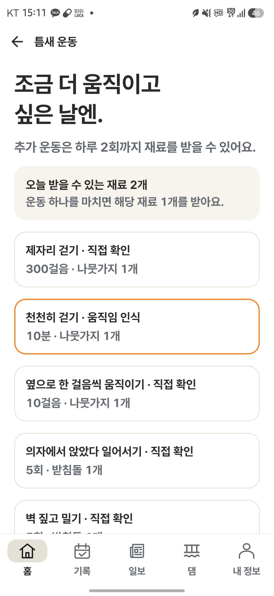
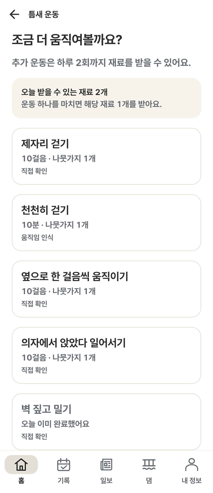
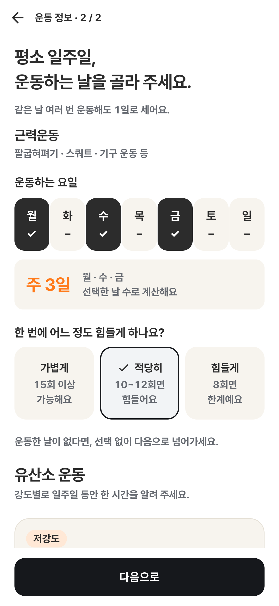
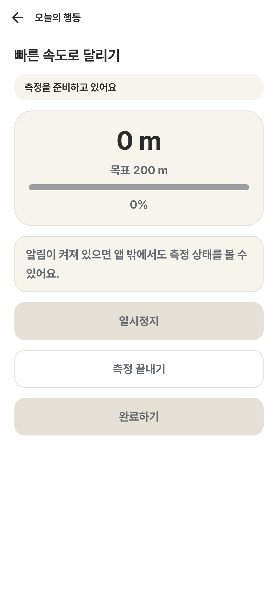

## 무엇을 왜 바꿨나요?

최신 Figma와 사용자 기기 QA를 반영해 Android의 홈·카드·신문·운동 입력을 최종 UI로 통합합니다. 근력운동은 요일을 골라 주당 일수를 확인하도록 바꾸고 유산소 입력은 유지했습니다. 카드의 과한 제목·센서 전용 주황 테두리·km 표시를 정리해 읽고 사용하는 흐름을 다듬었습니다.

관련 PR: #15. `feature/tuntun-peer-vnext`의 `55cac9530cad4eb12fb60e141861b3f02b13b2bf`에서 출발합니다. UI PR을 이 브랜치에 먼저 통합한 뒤 기존 PR #15로 develop에 반영하는 순서입니다.

관련 요구사항: 최종 Figma A16-안, 9월 15일 사용자 화면 QA 및 이후 근력운동·센서 미션 피드백. 별도 요구사항 ID는 부여하지 않았습니다.

## 주요 변경

| 영역 | 반영 내용 |
| --- | --- |
| 공통 UI | Pretendard 계층, 공통 버튼·카드·시트, 화면 폭·글자 확대 대응, 선택·전환·보상 모션 |
| 첫 운동 입력 | A16 근력운동 요일 선택, 주당 일수 요약, 강도 선택. 기존 유산소 입력 유지 |
| 홈·카드 | 허리둘레 별도 카드, 홈 댐 요약 제거, 제목·행간·정렬 및 카드 선택 흐름 정리 |
| 틈새 운동·센서 | 센서 전용 주황 테두리 제거, 제목과 목표·측정 방식 분리, 거리 m 표시, 긴 내용 스크롤 |
| 틈튼일보·댐 | 신문 계층과 카드 진입, 최신 캐릭터·이미지 잘림 보완, 새로고침·상단 로딩 문구 제거. 하단 댐 탭 유지 |
| 내 정보 | 신체 정보 명칭, 성별 읽기 전용, 권한 안내 여백. 앱 내부 접근성 설정 화면 제거, OS 글자 확대·TalkBack·동작 줄이기 유지 |
| 사운드·동작 | 앱 내부 효과음·홈 배경음 설정, 오디오 포커스·무음 모드 대응. 배경음 기본 꺼짐 |
| 클라이언트 QA | 센서 시작 권한·일시정지/재개·동기화 대기, 로그인 상태, 알림 설정 보완 |

누적 변경은 Android 소스 **168개 경로(추가 101·수정 66·삭제 1)**와 이 설명·화면 이미지 5개 파일입니다. Git의 이름 변경 감지에서는 접근성 보조 클래스의 테스트 폴더 이동이 하나로 묶여 Android 167개 파일로 보입니다. UI 폴더뿐 아니라 리소스와 Android 클라이언트 연결 코드도 함께 검토해야 합니다.

## 범위 밖·후속 작업

- 실제 서버 전체 통합 테스트, Google OAuth 로그인, 실외 GPS 정확도 및 iOS 검증은 포함하지 않습니다.
- 제공 테스트 APK에는 Google 웹 클라이언트 ID가 없으므로 팀 설정·서명으로 다시 빌드해야 합니다. APK·키·local.properties는 이 PR에 포함하지 않습니다.
- PR #15의 기존 [Actions 실행](https://github.com/AI-HealthCare-05/AH_05_01/actions/runs/34919127002)은 UI 적용 전부터 실패했습니다. Python 8개 파일의 서식 검사, MySQL 연결로 인한 인증·사용자 API 검사 10개 setup 오류, 점수 서비스 테스트 객체의 `is_pregnant` 누락으로 인한 실패 5개를 별도로 해결해야 합니다.

## 계약·데이터 영향

- [x] 서버 API/OpenAPI 변경 없음
- [x] DB migration 없음
- [ ] Android 권한·로컬 저장소 변경 없음
- [x] 환경 변수·인프라 변경 없음
- [x] 기존 서버 요청 형식과 호환

Android에는 `ACCESS_COARSE_LOCATION` 선언을 기존 정밀 위치 권한과 함께 추가하고 측정 종류에 맞는 포그라운드 서비스 시작 처리를 보완합니다. 사운드 설정은 앱 내부 `tmtn_sound` SharedPreferences에 저장하며 서버로 보내지 않습니다.

근력운동은 기존 요청 5개 필드를 그대로 사용합니다. 0~4일은 선택한 날 수, 5~7일은 기존 `strength_weekly_count=5`로 보내며 0일이면 `strength_intensity=null`입니다. 요일 자체와 정확한 6·7일 정보는 서버에 저장하지 않습니다. 저·중·고강도 유산소 분 단위 필드도 그대로입니다. 기존 일수만 복원할 때 특정 요일을 임의로 선택하지 않습니다.

신문의 추가 운동 기록 조회는 서버에 이미 있는 `GET /exercise-mission-records?from=…&to=…`와 기존 응답 6개 필드를 연결합니다. 새 API·DB 작업이 필수인 변경은 없습니다. 서버 주소 처리, ExerciseMissionApi, MissionSyncManager 및 Android 의존성 설정은 그대로입니다.

## 검증

### 자동 검증

```text
검증된 앱 소스 기준 트리: e18a6b263ee7f4851522eebe5a188166ca0dffe8
이 PR의 Android 소스는 위 트리와 동일하며 설명·화면 파일만 추가했습니다.

:app:assembleDebug                         PASS
:app:testDebugUnitTest                     83 tests, 0 failures/errors/skipped
:app:compileDebugAndroidTestKotlin          PASS
:app:lintDebug                             0 errors, 134 warnings, 26 information
별도 검증 앱에서 Android instrumentation     58 tests PASS
기기                                      Galaxy S23+ / Android 16
최종 패치를 새 전체 체크아웃에 실제 적용       PASS, 동일 소스 확인
develop 6e57ac6과 앱 소스 시험 병합           충돌 0
기존 Android 밖의 추적 파일 299개            전부 동일
```

단위·기기 검사는 앞서 같은 소스로 실행한 결과입니다. 업로드 준비 중 앱 소스를 다시 수정하지 않았습니다. 선택한 요일의 128가지 부분집합, 0일 강도 처리, 5~7일 매핑, 유산소 필드 보존, 320dp·1.8배 글자, 360dp 긴 제목, 센서·오류·카드 확정 흐름을 확인했습니다. 기존 Lint 경고나 GitHub 서버 검사 실패를 모두 해결했다는 의미는 아닙니다.

### 수동 검증

1. 실제 Android 컴포넌트를 검증용 데이터로 실행한 캡처에서 요일·강도·유산소 배치, 카드 테두리, 제목 줄맞춤, m 표시를 확인했습니다.
2. PR #15 최신 커밋과 패치 기준, 서버의 기존 기록 조회 DTO 및 운동 습관 DTO를 대조했습니다.
3. 실제 운동 수행·실계정 회원가입을 수동 검증한 결과는 아닙니다. 아래 이후 화면은 테스트 데이터이며 목표값을 운영 미션 변경의 근거로 사용하지 않습니다.

### 화면 변경

이전: 사용자가 전달한 기기 화면. 이후: 최종 코드의 실제 Android 캡처. 서로 다른 기기 폭·검증 데이터이므로 시각 구성 비교용입니다.

| 틈새 운동 이전 | 틈새 운동 이후 |
| --- | --- |
|  |  |

| A16 근력운동 요일 선택 | 센서 미션 m 표시 |
| --- | --- |
|  |  |

## 보안·개인정보·건강정보

- 새 서버 수집 필드 없음. 선택한 요일은 기존 운동 일수로 변환하며 추가 분석·전송 필드를 만들지 않습니다. 앱 내부 사운드 선호만 로컬에 추가 저장합니다.
- 위치·신체 활동은 기존 센서 미션 흐름에서 사용합니다. 위치 권한 거부와 미지원 기기의 대체 흐름을 검토했으며 추가 Android 권한 선언은 위에 명시했습니다.
- 계정 삭제·서버 보존 정책·동의 범위는 바꾸지 않습니다. 테스트 기록은 운영 계정에 작성하지 않았습니다.
- 틈튼지수의 비진단 안내와 서버 계산을 유지하며 프런트에서 새 건강 추정값을 만들지 않습니다.
- 변경 파일과 첨부 화면에 실계정 토큰·비밀번호·키·건강 기록을 넣지 않았습니다. 저장소 전체 과거 이력의 비밀정보 검사 결과를 의미하지는 않습니다.

## 배포·롤백

- 배포 순서: Android 담당자 검토 → UI PR을 `feature/tuntun-peer-vnext`에 통합 → 기존 PR #15의 서버 CI 해결·검토 → develop 통합 → 팀 서버 주소·OAuth·서명으로 앱 빌드 및 로그인·센서 최종 점검. 실제 서버가 PR #15의 API를 포함하는지 확인합니다.
- 롤백: 이 UI PR의 커밋을 revert한 앱을 다시 빌드합니다. 서버·DB rollback이나 데이터 초기화는 필요하지 않습니다. 이후 팀 코드와의 revert 충돌은 별도 검토합니다.
- 관찰 항목: 로그인·화면 조회 실패, 센서 서비스 시작/재개/완료 동기화, 추가 운동 보상과 중복 완료, 알림 허용 시간. 기존 로그에 계정 토큰·위치 원본·건강정보를 추가하지 않습니다.

## 작성자 체크리스트

- [x] 최종 Android UI 통합이라는 하나의 목적에 집중했습니다.
- [x] 변경 범위와 핵심 계약·위험 경로를 검토했습니다.
- [x] 개발자 설명과 실제 화면을 함께 추가했습니다.
- [x] 정상·실패·경계 시나리오를 포함한 단위·기기 검사를 수행했습니다.
- [x] 이번 변경에 토큰·비밀번호·환경 파일·서명키를 추가하지 않았습니다.
- [x] 글자 확대·권한 거부·센서 대체 흐름을 검토했습니다.
- [ ] 서버 실제 연결과 완전한 오프라인 동작을 포함한 전체 E2E 검증
- [ ] 기존 서버 CI 실패 해결 및 이 PR의 GitHub 검사 통과
- [x] 배포·롤백 절차를 문서화했습니다.

## 리뷰 요청

- Android: `StrengthWeekdayFields`, `ExerciseFields`, `CardHomeState`, `SensorChallengeScreens`, `MissionSensorService`, `RunningManager`, `OnboardingState`, `ProfileState`, `JournalState`, `TmtnAudio`의 화면·상태 연결을 중점 검토해 주세요.
- 백엔드: 기존 계약 유지와 실제 배포 API를 확인하고 PR #15의 기존 서식·DB 테스트·점수 테스트 실패를 해결해 주세요. 이번 UI를 위한 서버 코드 수정 요청은 아닙니다.
- PR #15가 먼저 병합되거나 새 커밋이 추가되면 대상 브랜치와 충돌 검사를 다시 확인해야 합니다. 이 PR은 자동 병합하지 않습니다.
