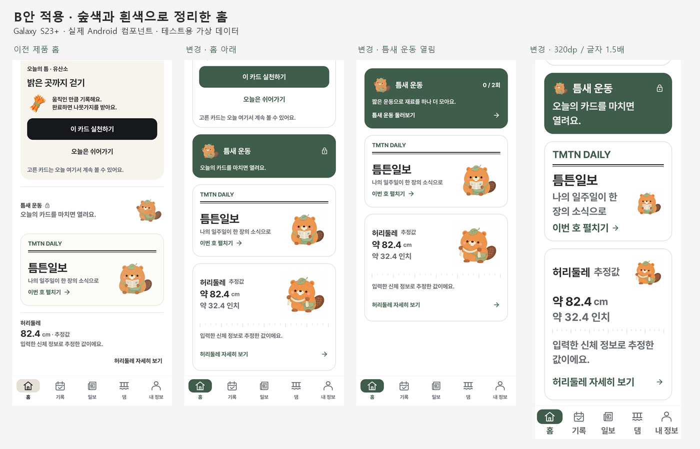
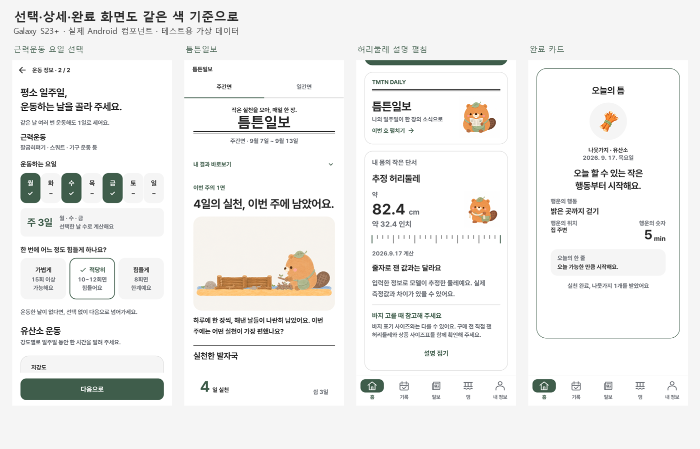

# 숲색 UI · 허리둘레 인치 표시

기준: `develop`의 `b807fec`(PR #19 병합). 사용자 승인 B안과 2026-09-17 파스텔 배경 제거 요청을 반영했다. Android 제품 소스에 적용한 변경이며 미리보기 전용 분기나 새 라이브러리는 추가하지 않았다.

## 화면별 변경

| Before · 기존 | After · 변경 | Why · 이유 |
|---|---|---|
| 검정 주요 버튼, 베이지·살구·세이지 컨테이너가 혼재 | 주요 동작·선택·탭은 숲색 `#3F5D4B`, 카드 바탕은 흰색, 보조 면은 무채색 | 승인한 B안으로 역할별 색을 통일 |
| 홈 틈새 운동이 별도의 단순 행으로 표시 | 작은 비버·잠금 또는 횟수·설명·진입 동작을 숲색 카드 안에 정렬 | 오늘 카드 다음 행동으로 읽히도록 구성 |
| 틈튼일보와 허리둘레 주변에 종이색 배경 | 흰색 카드와 중립 회색 외곽선, 신문·줄자 비버의 배경 정리 | 세이지·베이지 배경 제거 |
| 허리둘레 cm 값만 표시 | 홈·상세에서 cm와 인치 병기, 추정값 표시 및 구매 참고 설명 | 단위 이해를 돕고 바지 표기 사이즈와 혼동 방지 |
| 큰 글자에서 그림과 수치가 가로 공간을 경쟁 | 그림 축소, 값 영역을 아래로 이동, 설명·링크 줄바꿈 확보 | 320dp 폭·글자 1.5배에서 읽기 유지 |
| 완료 카드에 오래된 크림색 프레임과 센서 주황 테두리 | 흰색 바탕·숲색 테두리·공통 Pretendard 글꼴, 측정 방식 배지는 유지 | 미션 유형과 관계없이 카드 스타일 일관성 유지 |
| 그래프·요약 수치에 일반 강조용 주황이 혼재 | 일반 강조는 숲색, 달력의 오늘 표시와 오류의 의미 색은 유지 | 동작·선택과 상태 의미를 분리 |

원본 캐릭터의 털·나뭇잎·가방·재료 색은 유지한다. 카드 뒷면의 기존 숲색 그림도 유지한다. 모든 삽화 내부까지 단색으로 바꾸는 작업은 아니다.

## 정보와 동작

- `HomeSupportCards.kt`: 틈새 운동과 허리둘레 요약 컴포넌트. 홈 좌우 20dp, 카드 사이 16dp, 카드 내부 가로 18dp·세로 16dp. 큰 글자에서는 허리둘레 숫자를 그림 아래로 이동한다.
- 틈새 운동의 잠금·완료·일일 보상 횟수와 진입 경로는 기존 상태를 사용한다. 보상 한도 이후에는 기존처럼 둘러보기가 가능하다.
- 허리둘레 상세는 기존 자리에서 펼침·접기를 유지한다. 로딩·없음·오류·재시도 상태도 유지한다.
- 서버에서 받은 cm 원값을 `BigDecimal("2.54")`로 나눠 소수 첫째 자리 `HALF_UP`으로 인치를 표시한다. cm 표시값을 먼저 반올림한 뒤 나누지 않는다. 예: `81.41 cm → 32.1 인치`.
- 결과는 계속 추정값으로 표시한다. 새로운 건강 구간·권장 바지 사이즈·예측 결과를 만들지 않는다.
- 기존 버튼 누름, 시트 드래그·진입·퇴장, 시스템 동작 줄이기 대응을 유지한다.

색·글자·간격·상태별 기준은 [Android 디자인 기준](../android/DESIGN.md)을 따른다.

## 계약과 백엔드 영향

백엔드에서 추가로 해야 할 작업은 없다. API 요청·응답, DB, 마이그레이션, 예측 모델, 권한, 로컬 저장 형식, 센서 수집·완료 판정은 변경하지 않았다. 인치는 화면에서만 환산하며 서버에는 기존 cm를 그대로 사용한다.

## 검증

- 제품 `assembleDebug`, `assembleDebugAndroidTest`: 성공.
- JVM `testDebugUnitTest`: 123개 통과, 실패 0개.
- 휴대폰 계측 테스트: 34개 통과, 실패 0개.
- `lintDebug`: 성공, 오류 0개 / 경고 109개 / 정보 27개. 저장소 전체의 기존 정리 과제가 남아 있으며 경고가 없는 빌드라는 의미는 아니다.
- `git diff --check`: 통과.

실행: `:app:assembleDebug :app:assembleDebugAndroidTest :app:testDebugUnitTest :app:lintDebug --offline --no-daemon --no-configuration-cache`.

- 기준 기기: Galaxy S23+ (SM-S916N), Android 16.
- 테스트는 제품 소스에서 별도 applicationId를 준 QA APK로 실행한다. 일반 설치 앱의 계정·기록을 덮어쓰지 않는다.
- UI 검증은 가상 데이터로 실행한다. 실제 계정 로그인, 실외 거리 측정, 서버 보상 지급까지 검증했다는 의미는 아니다.
- 확인 범위: 홈 카드 미선택·선택, 허리둘레 펼침·접기·없음·오류, 큰 글자, 틈새 운동 잠금·열림·보상 한도, 근력 요일·유산소 기존 입력, 센서 m 표시·중립 외곽선, 월요일 시작 주간면·미래 날짜 비활성화, 동의 문서 이동, 내 정보·댐 이동, 버튼 중복 클릭 차단, 시트·동작 줄이기.
- 기존 테스트 2개가 이전 APK에서도 같은 위치에서 실패함을 별도로 확인했다. 삭제된 앱 자체 고대비 옵션을 기대하던 테스트는 현재 Material·공통 컴포넌트의 숲색/흰색 전달 검사로 갱신했다. 주간면 테스트는 이미 제거된 강제 줄바꿈 대신 현재 표시 문구를 스크롤해 확인하도록 수정했고, 월요일 시작·미래 날짜 비활성화 검사는 유지했다.
- Python `ruff format --check`, `ruff check`, `pytest`는 로컬 uv가 `0.12.3`, 저장소 요구가 `==0.12.5`여서 시작 전에 중단됐다. 버전 제약이나 백엔드 파일을 수정하지 않았으며 해당 검증은 PR의 기존 CI 결과와 구분한다.

## 삽화 기록

기존 `beaver_newspaper.png`, `journal_beaver_waist.png`를 참조해 Codex 내장 `imagegen`으로 배경을 정리했다. 캐릭터와 자세·소품을 유지하고 종이색 바탕을 흰색으로 바꾸는 편집이다. 새 리소스는 `beaver_newspaper_white.png`, `beaver_waist_white.png`이며 원본과 이전 크림색 카드 앞면은 `android/design-assets/before-forest/`에 보존했다. 앱에서 쓰지 않는 이전 자산을 APK에 포함하지 않는다.

최종 요청 내용: 기존 비버 얼굴·수채화 질감·잎 모자·가방·꼬리·신문 또는 줄자를 유지하고, 빈 배경을 흰색으로 바꾼다. 베이지·세이지·그림자·체크무늬·새 문구를 추가하지 않는다. 전체 몸과 소품을 자르지 않는다.

두 이미지는 불투명 PNG다. 투명 배경으로 오인해 다른 색 바탕에 재사용하지 않는다. 홈과 신문에서는 흰색 바탕에 사용한다.

## 배포와 되돌리기

Android 앱 업데이트만 필요하다. 서버 선행 배포나 데이터 변환은 필요 없다. 문제가 생기면 이 PR을 되돌려 이전 UI로 복구한다. 출시 전 작은 화면과 큰 글자에서 홈·상세·완료 카드·선택 상태를 다시 확인한다.
