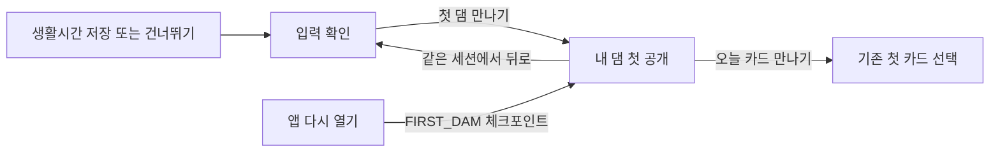

# 첫 댐 시작 단계와 가입 흐름 — 2026-09-16

## 확인한 피그마와 서버 규칙

확인 대상은 사용자가 최신으로 지정한 `★ 12 · 수정안 2`, 페이지 `1314:2411`이다. 레이어 이름만 보지 않고 개별 화면의 design context와 스크린샷을 함께 확인했다.

| 근거 | 현재 내용 |
| --- | --- |
| [A20 · 입력 확인](https://www.figma.com/design/ByGT2uoinUBxAQOBqAK7sM/TMTN?node-id=1314-2734) | 입력을 확인한 뒤 ‘첫 댐 만나기’ |
| [A21 · 내 댐 첫 공개](https://www.figma.com/design/ByGT2uoinUBxAQOBqAK7sM/TMTN?node-id=1314-2748) | 0단계 댐 그림. ‘오늘은 첫 재료를 모아 볼까?’ |
| [A31 · 첫 재료](https://www.figma.com/design/ByGT2uoinUBxAQOBqAK7sM/TMTN?node-id=1314-2914) | 첫 실천 저장 후 나뭇가지 +1 |
| [A32 · 첫 재료가 모인 댐](https://www.figma.com/design/ByGT2uoinUBxAQOBqAK7sM/TMTN?node-id=1314-2929) | 재료 1개, 0단계 그림, 다음 단계까지 4개 |
| `app/dtos/companion.py` | 누적 재료 5 / 15 / 35 / 70 / 120개부터 1 / 2 / 3 / 4 / 5단계 |
| `app/services/companion_service.py` | 재료 합계로 단계를 계산. 0~4개는 0단계 |

따라서 **현재 피그마와 서버는 가입만으로 1단계를 주는 규칙이 아니다.** A32의 레이어 이름에는 ‘다음 단계까지28개’라는 오래된 이름이 있지만 실제 화면 본문은 ‘4개’다. 레이어 이름의 옛 숫자를 구현에 사용하지 않는다.

가입 시 첫 빈틈을 메워 실제 1단계로 시작하도록 바꾸려면 별도 기획 변경이다. 현재는 사용자에게 선택을 요청한 상태이며, 답변 없이 서버 보상이나 단계 임계값을 변경하지 않았다.

## 이번에 복원한 흐름

- 기존 앱은 입력 확인에서 바로 첫 카드 선택으로 넘어갔다. A21 첫 댐 소개가 누락된 상태였다.
- 이제 ‘첫 댐 만나기’ → 실제 댐 그림·현재 단계·재료 수·다음 복구까지 남은 수를 확인한다.
- 가입 첫 상태는 0단계·재료 0개, 이미 기록이 있는 계정은 서버의 기존 단계를 그대로 표시한다. 화면 진입/재진입으로 재료를 지급하거나 단계를 초기화하지 않는다.
- 로딩/실패를 0단계로 대체하지 않는다. 실패 시 재시도를 제공하고 카드 선택은 계속할 수 있다.
- 입력 확인과 첫 공개에 체크포인트를 저장한다. 첫 공개 재개 시 이미 완료한 건강/운동 입력 API를 다시 읽느라 가입을 되돌리지 않는다.
- 첫 공개에서 앱을 종료·재시작했다면 해당 화면을 재개 지점으로 삼는다. 메모리에 없는 입력값을 기본값으로 요약하지 않도록 이때만 요약으로 돌아가기 버튼을 생략한다. 시스템 뒤로가기는 앱을 나가며 체크포인트는 남는다. 계속하기로 기존 첫 카드 선택에 진입할 수 있다.
- 첫 카드 선택 시 기존 완료 콜백을 사용한다. 실제 완료/재료 지급/단계 상승 처리 경로는 그대로다.
- 입력 요약의 근력 단위를 ‘회’에서 ‘일’로 수정했다. 현재 선택한 6·7일은 그대로 표시하고, 서버에서 복원한 상한 코드 5는 ‘5일 이상’으로 표시한다. 서버에 보내는 기존 0~5 코드는 유지한다.
- 성별 등 모든 값을 변경할 수 있는 것처럼 보이던 안내를 ‘키·몸무게와 운동 정보’로 좁혔다.

## UI 적용 범위

기존 Pretendard, 좌우 20dp, 본문 16/26sp, 제목 28/36sp, 카드 radius 16dp, 공통 버튼을 재사용했다. 고정 CTA와 스크롤 본문을 분리해 큰 글자에서 내용을 자르지 않는다. 기존 Figma 원본 댐 스프라이트를 재사용하고 재료·그림을 새로 만들지 않았다.

A21의 샘플 점수 75.6은 복사하지 않았다. 실제 점수·일보는 기존 해당 화면에서 조회한다. 이번 범위는 첫 댐 소개와 카드 진입이며, A22 창간호 전용 온보딩과 분석 점수 카드 전체를 새로 구현한 것은 아니다.

## 바뀐 소스

경로 기준: `android/app/src/`.

- `main/java/com/tmtn/app/ui/onboarding/FirstDamScreen.kt`: 첫 공개 UI, 기존 companion GET, 로딩/실패/재시도.
- `main/java/com/tmtn/app/ui/onboarding/OnboardingState.kt`: FIRST_DAM 상태와 체크포인트.
- `main/java/com/tmtn/app/ui/onboarding/OnboardingFlow.kt`: 입력 확인 → 첫 공개 → 기존 첫 카드 선택.
- `main/java/com/tmtn/app/ui/onboarding/OnboardingScreensA15Complete.kt`: CTA, 단위, 수정 가능 정보 안내.
- `test/java/com/tmtn/app/ui/onboarding/FirstDamStateTest.kt`: 실제 단계 보존, 실패/재시도, 취소.
- `androidTest/java/com/tmtn/app/ui/FirstDamUiTest.kt`: 소개·기존 단계·오류·확대 글자·요약/재개.

백엔드·API/DTO·DB·보상 지급·센서 코드는 변경하지 않았다. 새 POST나 마이그레이션 없이 기존 companion 조회 GET만 첫 소개에서 사용한다.

## 실제 1단계 시작으로 기획을 바꿀 때

UI에서 숫자만 1로 바꾸거나 클라이언트가 가짜 완료/재료를 보내면 서버 기록·일보·단계 알림이 서로 달라진다. 서버 기준을 함께 바꿔야 한다.

1. 첫 복구가 가입 보상인지 실제 첫 미션 완료인지 확정한다.
2. 현재 임계값을 유지한다면 첫 복구 보상을 계정당 한 번만 지급하고, 재시도·동시 기기·중단 후 재개에서도 중복 지급되지 않도록 서버 트랜잭션으로 처리한다. 기존 기록을 실제 운동으로 위장하지 않는다.
3. 단계 로그·재료 합계·일보·카드 이력의 표시 범위를 맞추고 기존 계정 적용 여부를 정한다.
4. 보상 대신 1단계 임계값을 변경한다면 기존 사용자 단계와 축하 알림에도 영향이 있으므로 회귀 검증한다.

이는 구현 제안이며 이번 수정에 반영된 서버 정책이 아니다.

## 검증 결과와 전달본

- 최종 APK와 테스트 APK 빌드 성공. `build-first-dam-resume.log`.
- 전체 JVM 테스트 **94개 통과**, 실패/오류/건너뜀 0. 신규 FirstDamStateTest 3개 포함.
- 실제 SM-S916N / Android 16에서 **14개 통과**, 실패 0. FirstDamUiTest 5개 + SeptemberReviewUiTest 4개 + GoogleEntryUiTest 5개. `device-first-dam-final.log`.
- Lint 오류 0, 경고 109, 정보 26. 기존 경고 모두를 해결한 것은 아니다.
- 첫 공개·기존 3단계·조회 실패·320dp/1.8배 글자 캡처 4장을 직접 확인했다. 이미지 전체 비율과 고정 CTA를 유지하고 큰 글자는 스크롤로 읽는다.
- 첫 시도는 휴대전화가 Dozing 상태여서 14개 모두 Compose 계층을 찾지 못했다. 화면을 깨운 뒤 재시험했고, 이후 재개 경로 보완을 포함한 최종 APK도 14개 통과했다. 기기 잠금·절전 실패를 앱 통과로 계산하지 않았다.

상위 프로젝트 `docs/ui-review-2026-09-16/` 전달 파일:

- `first-dam-gallery.html`: 이번 변경의 캡처와 흐름.
- `tmtn-first-dam-2026-09-16-qa.apk`: 별도 QA 앱 `com.tmtn.app.polishqa`. 기존 앱/사용자 기록을 덮어쓰지 않는다.
- `first-dam-verification.json`: APK·소스·캡처 해시와 실행 기록.
- APK SHA256: `6CD7ED67EFFB46C8E12AE15EB4A76B78C346098338BC13D79C03FD76B0BCA318`.

기존 62개 기기 시험의 APK와 기록은 이전 UI 리뷰 스냅샷이다. 이번 APK에서는 변경과 관련된 14개를 다시 실행했다. 캡처는 실제 Compose 화면에 fixture를 주입한 결과다. 실제 신규 계정을 만들거나 원격 보상을 지급하는 E2E 시험, Google OAuth 성공, 실외 센서 검증은 수행하지 않았다. GitHub push는 수행하지 않았다.
