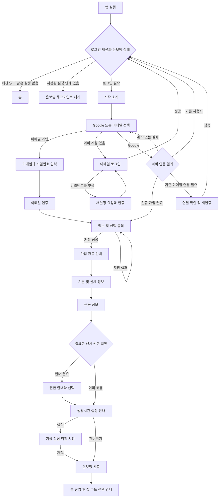
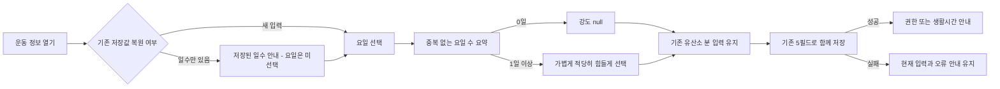
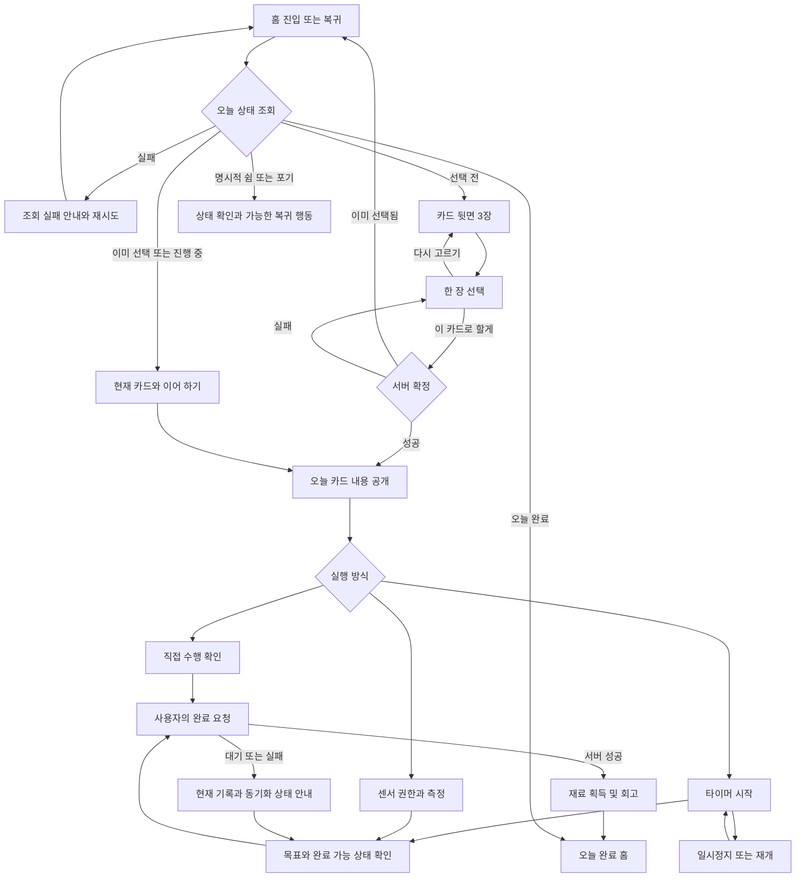
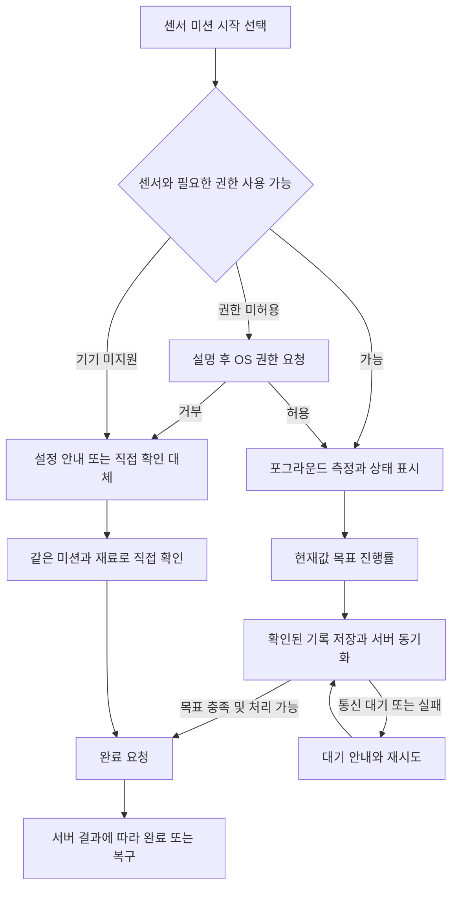
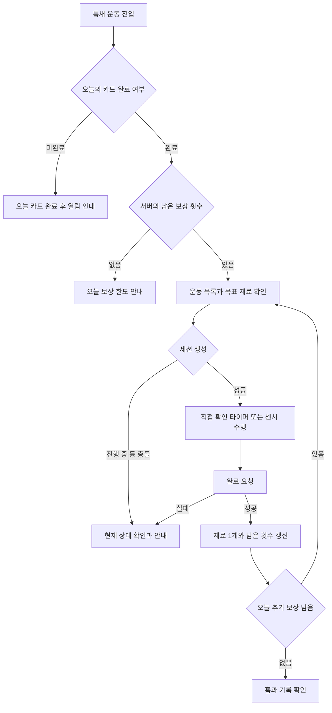
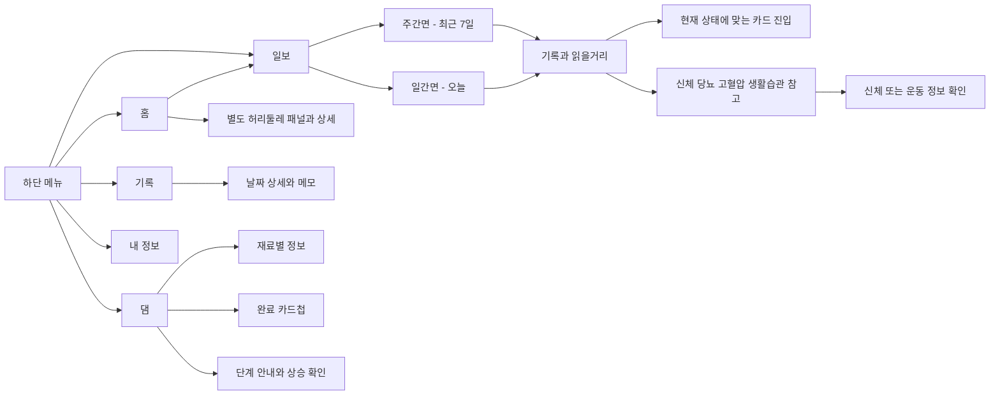

# 틈튼 현재 사용자 흐름

버전 2.0 · 2026-09-15 · [PRD](PRD.md) / [요구사항 정의서](요구사항정의서.md)

아래는 현재 Android의 화면·상태 연결을 설명하는 흐름도다. 선이 연결돼 있다는 것은 실제 운영 서버·OAuth·모델 시험 완료를 의미하지 않는다. 실패 시 입력·선택·확인된 기록을 보존하는 원칙과 현재 한계를 함께 표시했다.

## 1. 앱 진입·회원가입

주요 구현: [OnboardingFlow](https://github.com/AI-HealthCare-05/AH_05_01/blob/c5193b391d616201a7dacd026ec0258cf2e236ee/android/app/src/main/java/com/tmtn/app/ui/onboarding/OnboardingFlow.kt), [OnboardingState](https://github.com/AI-HealthCare-05/AH_05_01/blob/c5193b391d616201a7dacd026ec0258cf2e236ee/android/app/src/main/java/com/tmtn/app/ui/onboarding/OnboardingState.kt), [MainActivity](https://github.com/AI-HealthCare-05/AH_05_01/blob/c5193b391d616201a7dacd026ec0258cf2e236ee/android/app/src/main/java/com/tmtn/app/MainActivity.kt).

| 상황 | 처리와 확인할 점 |
| --- | --- |
| 가입 중 다시 열기 | 저장한 체크포인트·계정 생성 여부를 확인한다. 미완료 계정을 완료한 것으로 보내지 않는다. |
| 동의 저장 일부 실패 | 계정 생성과 동의 저장을 구분해 재시도한다. 계정을 반복 생성하지 않도록 실제 서버로 확인한다. |
| Google 선택 취소 | 앱의 인증 선택 화면으로 복귀한다. 실패를 로그인 성공으로 처리하지 않는다. |
| Google 토큰 만료 | 계정 재선택·재인증 안내. 전달 APK의 OAuth 미설정과 사용자 비밀번호 오류를 혼동하지 않는다. |
| OS 권한 거부 | 설정 또는 해당 미션의 직접 확인 대체 경로를 제공한다. 온보딩 전체 탈락으로 취급하지 않는다. |
| 401 세션 만료 | 측정·알림 등 사용자 상태를 정리하고 재로그인 안내. 로그인 후 현재 서버 상태를 다시 확인한다. |

## 2. 첫 운동 입력: A16 근력운동 요일 선택

- 기준 문구는 **평소 일주일의 운동하는 날**이다. 처음 제안 이미지의 실제 날짜·지난주 일별 로그 수집으로 해석하지 않는다.
- 월·수·금을 고르면 현재 화면은 주 3일, 서버는 `strength_weekly_count=3`이다.
- 6·7개를 골라도 서버 저장은 기존 5일 이상 구간인 5다. 정확한 요일을 저장·복원하는 기능은 없다.
- 유산소 저·중·고강도 분 입력과 저장 버튼은 기존 흐름을 사용한다. 근력만 별도 서버 요청으로 분리하지 않는다.
- 작은 폭·큰 글자에서는 요일을 여러 줄로 배치한다. 글자 크기를 임의로 줄여 7개를 한 줄에 밀어 넣지 않는다.
- 내 정보 → 운동 정보는 현재 기존 일수 선택 UI다. 첫 입력과 시각 형태가 달라도 같은 계약을 쓴다.

**화면 번호 주의:** Figma A16-안은 코드의 `A08_EXERCISE`와 `StrengthWeekdayFields`다. 코드 enum `A16_PERMISSIONS`는 권한 안내다. 과거 A/B/C 번호만으로 담당 개발 파일을 지정하지 않는다.

## 3. 홈·오늘의 카드

| 홈 상태 | 주 행동 | 주의 |
| --- | --- | --- |
| 선택 전 | 오늘 카드 고르기 | 선택 전 내용을 모두 공개하는 목록으로 바꾸지 않는다. |
| 카드 확정·미시작 | 이 카드 실천하기 | 오늘 선택한 카드 유지 |
| 진행·일시정지 | 이어 하기·카드 다시 보기 | UI가 서버의 확정·누적 상태를 덮어쓰지 않음 |
| 완료 | 완료 기록 확인·틈새 운동 | 재료 중복 지급 금지 |
| 쉼 | 쉼 상태·취소 또는 전환 가능한 행동 | 사용자가 선택해야 쉼, 서버 주간 한도 사용 |
| 포기 | 포기 상태·가능한 재시작 경로 | 쉼·완료와 별개. 실제 서버 상태를 다시 확인 |

일시정지·포기·쉼의 정확한 서버 전이는 [CardHomeState](https://github.com/AI-HealthCare-05/AH_05_01/blob/c5193b391d616201a7dacd026ec0258cf2e236ee/android/app/src/main/java/com/tmtn/app/ui/cardhome/CardHomeState.kt), [challenge_service](https://github.com/AI-HealthCare-05/AH_05_01/blob/c5193b391d616201a7dacd026ec0258cf2e236ee/app/services/challenge_service.py), [record_service](https://github.com/AI-HealthCare-05/AH_05_01/blob/c5193b391d616201a7dacd026ec0258cf2e236ee/app/services/record_service.py)를 따른다. 네트워크 실패 상태에서 화면만 완료나 쉼으로 확정하지 않는다.

## 4. 센서·틈새 운동

거리 화면은 `0 m / 목표 200 m`처럼 표시한다. 센서 카드만 주황 테두리를 붙이지 않는다. 화면을 닫은 상태의 측정·알림과 앱 프로세스 종료 후 복구는 별개 시나리오로 시험한다. 확인하지 못한 구간을 운동 수행량으로 추정하지 않는다.

보상 한도는 하루 2회이며 완료한 날 수와 다른 지표다. 추가 운동 기록은 `(service_date, reward_slot)`으로 중복 집계를 방지한다. 서버의 목록·진행 상태·거절 사유를 따르며 오래된 로컬 횟수만으로 시작시키지 않는다.

## 5. 기록·일보·댐

- 홈에는 댐 요약 카드를 두지 않는다. 댐 탭과 그 안의 기능은 유지한다.
- 홈 최근 7일·달력은 가입 이전 날짜를 미완료로 표시하지 않는다. 기록 못 읽음과 실제 기록 없음을 구분한다.
- 일보 주간면은 최근 7일, 쉼 한도는 월~일이다. 문구에 ‘이번 주’가 있더라도 기간 숫자를 확인해야 한다.
- 일보 상단 수동 새로고침은 없다. 자동 조회·영역별 실패·카드로 이동하는 행동은 유지한다.
- 일보에서 선택된 카드로 돌아갈 때 오늘의 서버 상태를 확인한다. 이미 완료한 카드를 미완료 실행 화면으로 보내지 않는다.
- 카드첩은 완료한 오늘 카드, 신문 추가 운동은 별도 기록 API다. 총 재료 수와 카드첩 개수가 항상 같을 것으로 가정하지 않는다.

## 6. 건강 참고 정보의 분기

| 요청 | 조건 | 화면 결과와 한계 |
| --- | --- | --- |
| peer 조회 | 분석 미동의 | 동의 안내·미산출. 일반 카드 사용과 구분 |
| peer 조회 | 브릿지 미설정·실패 | 서버 오류·미산출. 고정 샘플 점수로 대체하지 않음 |
| peer 조회 | 일부 영역만 가능 | 영역별 이유 유지. 신문 종합 표시 조건에 미달하면 종합 점수를 만들지 않음 |
| peer 조회 | 유효한 결과 | 종합 점수와 영역별 또래 위치를 서로 다른 지표로 표시 |
| 신체/운동 입력 저장 | 허리 재계산 성공 | 서버 저장·공개 조건을 거친 결과를 앱에서 조회 |
| 신체/운동 입력 저장 | 허리 브릿지 미설정·계산 실패 | 입력 저장은 성공할 수 있음. 이번 입력의 추정 완료로 안내하지 않음 |
| 허리 공개 결과 조회 | 유효한 결과 없음 | 결과 없음. 0cm를 표시하지 않음 |
| 허리 공개 결과 조회 | 이전 성공 결과만 남음 | 계산 시점 확인. 현재 입력과 같은 버전이라고 단정하지 않음 |
| 허리 공개 결과 조회 | 조회 실패 | 결과 없음과 다른 실패 상태 |

허리둘레 재계산은 현재 서버에서 수행한다. 앱이 예측 생성·관리자 승인 API를 호출하거나 프런트에서 계산식을 만들어 채우는 흐름을 추가하지 않는다. 자세한 공개 정책과 한계는 [PRD](PRD.md)를 따른다.

## 7. 내 정보와 파괴적 작업

| 진입 | 가능한 일 | 반환·실패 처리 |
| --- | --- | --- |
| 기본 정보 | 이름·별명·생년월 확인·수정 | 저장 결과 후 복귀, 실패 시 오류 유지 |
| 신체 정보 | 성별 읽기, 키·몸무게 수정 | 성별 변경 선택지를 제공하지 않음 |
| 운동 정보 | 주당 근력 일수·강도·유산소 분 수정 | 현재 5필드 저장 계약 유지 |
| 생활시간·알림 | 생활시간·알림 설정 | 동의·권한·허용 시간 조건 함께 확인 |
| 연동·권한 | 신체 활동·위치·알림 안내와 기기 설정 | 기기 설정 복귀 시 권한 다시 확인 |
| 동의 관리 | 선택 동의 확인·철회 | 실패 시 철회 완료로 표시하지 않음 |
| 소리 | 효과음·배경음 켜기/끄기 | 로컬 저장, 서버 연결 없이 설정 유지 |
| 계정 | 이메일·비밀번호 변경·로그아웃·탈퇴 | 재인증·실패·세션 종료 경로 분리 |
| 데이터 | CSV 저장·기록 삭제 | 파일 저장 결과와 서버 삭제 결과 구분 |

탈퇴·기록 삭제는 실제 사용자의 데이터에 영향을 준다. 개발 QA는 별도 테스트 계정으로 실행하고 삭제 범위를 사전에 확인한다. 앱 내부 접근성 메뉴로 가는 경로는 제거됐으며, OS 접근성 설정에 따라 UI가 반응하는 것은 유지된다.

## 8. 회귀 점검 순서

1. 실제 서버를 사용한 신규 가입·기존 로그인·Google 연결을 각각 실행한다.
2. 첫 근력 0·3·7일 선택 후 저장과 재진입을 확인한다. 유산소 값이 유지되는지 대조한다.
3. 카드 확정·진행·일시정지·쉼·취소·완료를 확인한다.
4. 센서 거부·미지원 대체와 거리 m 표시, 앱 종료·연결 복구를 확인한다.
5. 완료 후 추가 운동 2회와 세 번째 시작 제한을 확인한다.
6. 홈·달력·일보·댐에서 같은 날짜와 보상 결과를 대조한다.
7. 입력 변경 후 점수·허리둘레의 오류·미산출·과거 결과를 확인한다.
8. 소리·권한·동의·CSV·삭제·로그아웃을 별도 시험 계정에서 확인한다.

이 목록은 추가 실서버 QA 절차이며 이번 문서 작성 중 모두 실행한 체크리스트가 아니다. 현재 확인된 시험 범위는 [UI 통합 설명](../ui-final-2026-09-15/README.md)에 있다.
